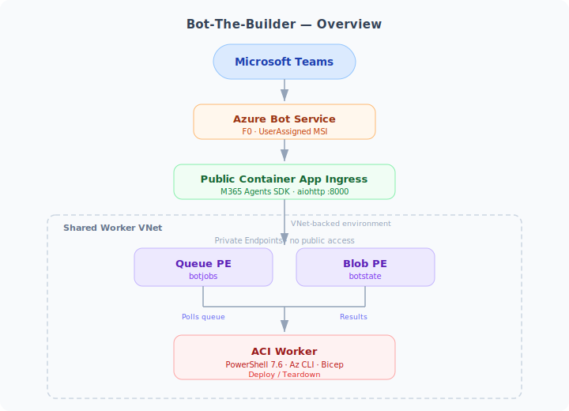

# 🤖 Microsoft Foundry — Agent Framework Observability PoC

Jupyter notebooks for Python 3.13+ that configure and query a Microsoft Agent Framework agent backed by Microsoft Foundry with **end-to-end observability** — tracing agent runs, tool invocations, and responses across Application Insights, Microsoft Foundry Traces, and Log Analytics.


---

## 📋 Prerequisites

| Requirement | Details |
|---|---|
| **🏗️ AI Foundry Environment** | Deploy the infrastructure first — see [`deployment/README.md`](deployment/README.md) for full instructions |
| **Azure CLI** | Installed and authenticated (`az login`) — [Install Azure CLI](https://aka.ms/installazurecli) |
| **Entra ID Permissions** | `Contributor` (or equivalent) on the Foundry project and Application Insights resource |
| **Microsoft Foundry Project** | Connected to an **Application Insights** instance backed by a **Log Analytics workspace** |
| **Model Deployment** | One allowed model (`gpt-4.1-mini`, `gpt-5.3`, `gpt-5.4`, or `grok-4-1-fast-reasoning`) is selected during deployment and auto-deployed — no manual setup needed |
| **Python 3.13+** | With `venv` support |
| **Jupyter Notebook** | VS Code with Jupyter extension or JupyterLab |

---

## 🚀 Quick Start

1. Run the deployment first — it generates `build_info-<suffix>.json` at the repo root (see [`deployment/README.md`](deployment/README.md))
2. Open `zolab-ai-agent-demo-macbook.ipynb` or `zolab-ai-agent-demo-win11.ipynb`
3. Run **Section 0** — creates `.venv` and registers the `AI Agent Demo (.venv)` kernel
4. Switch to the **AI Agent Demo (.venv)** kernel
5. Run sections **1 → 5** in order
6. Run **Section 6** and inspect telemetry in the Azure Portal:
   - 📊 **Application Insights** — request/dependency traces
   - 🔍 **Microsoft Foundry** — agent execution traces
   - 📡 **Log Analytics** — `AppDependencies` table queries

---

## 📓 Notebook Sections

After selecting the `AI Agent Demo (.venv)` kernel, run sections in order:

| # | Section | What It Does |
|---|---|---|
| **0** | Create or Reuse Virtual Environment | Creates `.venv`, installs `ipykernel`, registers Jupyter kernel |
| **1** | Install Dependencies | Installs the latest Agent Framework, Foundry, Azure identity, and OpenTelemetry packages used by the notebook |
| **2** | Import Libraries | Verifies imports for `DefaultAzureCredential`, `AIProjectClient`, `OpenAIChatClient`, and Agent Framework observability helpers |
| **3** | Configure Credentials and Clients | Reuses deployment values from `build_info-<suffix>.json`, resolves Azure auth, and configures both the Foundry project client and the Azure OpenAI-backed Agent Framework chat client |
| **3.1** | Enable Telemetry | Configures Azure Monitor + OpenTelemetry, Foundry client-side tracing, HTTP dependency telemetry, and trace propagation controls |
| **3.2** | Configure MSFT Learn MCP Tool | Sets up the [Microsoft Learn MCP endpoint](https://learn.microsoft.com/api/mcp) as a remote MCP tool for the Agent Framework agent |
| **3.3** | Configure Microsoft Sentinel MCP Tool | Preserves the existing Foundry project-connection dependency for the Sentinel MCP tool |
| **4** | Create the Agent | Creates the main Agent Framework agent and prepares the Sentinel-specific project agent when available |
| **5** | Query the Agent | Runs storytelling and Microsoft Learn grounded queries through Agent Framework and saves the results to `stories.json` |
| **5.1** | Query Microsoft Sentinel | Keeps the Sentinel MCP dependency path and runs the Sentinel-specific interaction separately |

For bot and worker post-deploy validation, run [deployment/run-smoke-checks.sh](deployment/run-smoke-checks.sh) and then exercise the manual Teams smoke sequence from [deployment/OPERATIONS-RUNBOOK.md](deployment/OPERATIONS-RUNBOOK.md).

---

## 🔑 Key Configuration

### Build-Time Notebook Configuration

The deployment script writes a repo-local `build_info-<suffix>.json` file at build time. The notebooks read the latest matching file in the **Confirm Existing Deployment** section and reuse it in **Section 3** to populate:

- `foundry_proj_ep` → the Microsoft Foundry project endpoint
- `genai_model` → the model name used when creating the agent

This removes the need to hardcode the Foundry project endpoint in the notebook or store it in source control.

### Observability

Section **3.1** configures the notebook's observability path end to end:

- **Azure Monitor + Application Insights** receive exported OpenTelemetry traces.
- **Microsoft Foundry client-side tracing** is enabled for project-backed agent and Responses API activity.
- **HTTPX dependency tracing** and explicit notebook-side client spans make outbound agent calls visible in Application Insights and Log Analytics.
- **Trace context and baggage propagation** are enabled so notebook correlation identifiers flow with downstream requests.
- **GenAI semantic conventions** are pinned to the latest experimental profile, while **message content recording stays off by default** unless explicitly enabled for debugging.

See [observability.md](observability.md) for the full environment variable reference, version posture, and design notes.

### MCP Tool Setup

```python
mcp_tool_spec = {
    "type": "mcp",
    "server_label": "msft-learn",
    "server_url": "https://learn.microsoft.com/api/mcp",
    "require_approval": "never",
}
```

The notebook keeps the Microsoft Sentinel MCP dependency on the Foundry project-connection path by design. That Sentinel-specific tool setup remains separate from the Agent Framework remote MCP configuration used for Microsoft Learn.

---

## 📊 Observability Flow

The notebook produces traces across three observability surfaces:

**Microsoft Foundry Traces (Preview)**


**Microsoft Foundry Traces (Preview)**


**Application Insights**


**Log Analytics - End-to-End Trace Correlation**


---

## 🏗️ Infrastructure

The `deployment/` directory contains Bicep IaC to provision the full AI Foundry environment — see [`deployment/README.md`](deployment/README.md) for details.

### Bot-The-Builder (Teams Bot)

The `bot-app/` directory contains **Bot-The-Builder**, a Teams bot that manages Foundry deployments via chat commands (`build it`, `list builds`, `build status <rg>`, `teardown`, `heartbeat`).

<picture>
  <source media="(prefers-color-scheme: dark)" srcset="./images/bot-overview-dark.svg">
  <source media="(prefers-color-scheme: light)" srcset="./images/bot-overview-light.svg">
  
</picture>

- **Azure Container App** — public Teams ingress is preserved, but the app now runs in a custom VNet-backed Container Apps environment
- **ACI Worker** — runs inside the shared worker subnet and polls Queue Storage over the private network path
- **Azure Queue + Blob Storage** — RBAC-only (no shared keys), `publicNetworkAccess: Disabled`, reached through private endpoints and private DNS
- **Shared worker VNet** — hosts the Container Apps infrastructure subnet, the ACI subnet, and the storage private endpoint subnet
- **Cross-sub logging** — Container Apps logging still targets `DIBSecCom` LAW when that shared key is available to the deployer; otherwise deployment proceeds without explicit LAW wiring

See [`bot-app/runtime/README.md`](bot-app/runtime/README.md) for full bot documentation and [`deployment/README.md`](deployment/README.md) for the Teams command listener.

---

## 🔧 Troubleshooting

| Issue | Fix |
|---|---|
| Agent Framework or Azure Monitor import errors | Rerun **Section 1 — Install Dependencies** so the notebook upgrades the pre-release Agent Framework packages in the active kernel |
| Signed-in account shows as unavailable | Rerun **Section 3 — Configure the Project Client** (uses `az.cmd` on Windows) |
| Telemetry cell fails after dependency changes | Restart kernel, rerun from **Section 1** through **Section 3.1** |
| Sentinel cell cannot resolve a project connection | Verify the Foundry project still contains the Sentinel MCP connection and rerun **Section 3.3** |

---

## ✅ Validation Checklist

- [ ] **Section 3** prints `🔐 Credential used: ...` and `👤 Signed-in account: ...`
- [ ] **Section 3.2** prints the [MSFT Learn MCP URL](https://learn.microsoft.com/api/mcp)
- [ ] **Section 3.3** resolves or prints the Sentinel MCP project connection details
- [ ] **Section 4** configures the main Agent Framework agent successfully
- [ ] **Section 5** returns a response and appends to `stories.json`
- [ ] **Section 5.1** returns a Sentinel response when the Foundry project connection is available
- [ ] **Section 6** returns data for end-to-end and trend KQL queries

---

## 📚 References

- [Microsoft Agent Framework (Python)](https://github.com/microsoft/agent-framework)
- [Microsoft Agent Framework Observability Samples](https://github.com/microsoft/agent-framework/tree/main/python/samples/02-agents/observability)
- [Microsoft Foundry SDK Overview (Python)](https://learn.microsoft.com/en-us/azure/foundry/how-to/develop/sdk-overview?pivots=programming-language-python#foundry-tools-sdks)
- [OpenTelemetry for Python: Instrumentation Guide](https://opentelemetry.io/docs/languages/python/instrumentation/)
- [Azure MCP Server Documentation](https://learn.microsoft.com/azure/developer/azure-mcp-server/)
