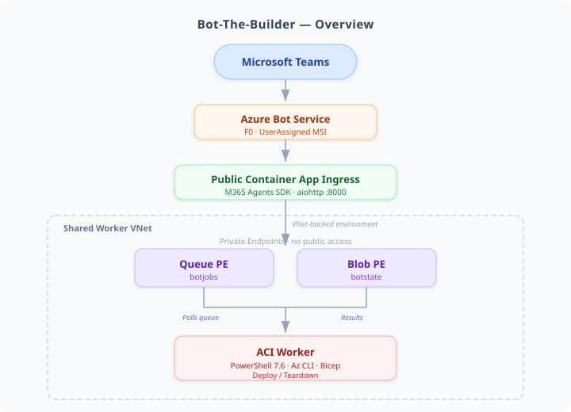

# 🤖 Microsoft Foundry — Agent Framework Observability PoC

Jupyter notebooks that configure and query Microsoft Foundry agents with **end-to-end observability** — tracing agent runs, tool invocations, and responses across Application Insights, Microsoft Foundry Traces, and Log Analytics. The Win11 notebook uses Azure AI Projects + the Responses API and native OpenTelemetry resource metadata; it does not require Agent Framework. It requires Python 3.14+; the separate macOS notebook supports Python 3.13+.


---

## 📋 Prerequisites

| Requirement | Details |
|---|---|
| **🏗️ AI Foundry Environment** | Deploy the infrastructure first — see [`deployment/README.md`](deployment/README.md) for full instructions |
| **Azure CLI** | Installed and authenticated (`az login`) — [Install Azure CLI](https://aka.ms/installazurecli) |
| **Entra ID Permissions** | `Contributor` (or equivalent) on the Foundry project and Application Insights resource |
| **Telemetry Read Access** | Log Analytics Reader (or equivalent query permissions) on the workspace linked to Application Insights; activate required PIM roles before the run |
| **Sentinel MCP** | Existing Foundry project connection, OAuth consent, and Sentinel/data-lake access for the signed-in identity; required to run every cell including Section 5.1 |
| **Microsoft Foundry Project** | Connected to an **Application Insights** instance backed by a **Log Analytics workspace** |
| **Model Deployment** | The deployment script offers `gpt-4.1-mini`, `gpt-5.3`, `gpt-5.4`, or `grok-4-1-fast-reasoning`. The notebook can also use an existing compatible deployment, such as `gpt-5.6-terra`, through its local build metadata (see below). |
| **Python** | Python 3.14+ for Win11 or Python 3.13+ for macOS, with `venv` support |
| **Jupyter Notebook** | VS Code with Jupyter extension or JupyterLab |

---

## 🚀 Quick Start

1. Run the deployment first — it generates `build_info-<suffix>.json` at the repo root (see [`deployment/README.md`](deployment/README.md))
2. Open `zolab-ai-agent-demo-macbook.ipynb` or `zolab-ai-agent-demo-win11.ipynb`
3. Run **Section 0** — creates `.venv` and registers the notebook kernel
4. On Win11, switch to the **AI Agent Demo (.venv, Python 3.14)** kernel
5. Run sections **1 → 5** in order
6. Run **Section 6** and inspect telemetry in the Azure Portal:
   - 📊 **Application Insights** — request/dependency traces
   - 🔍 **Microsoft Foundry** — agent execution traces
   - 📡 **Log Analytics** — `AppDependencies` table queries

On Windows, Section 1 installs [requirements-notebook.txt](requirements-notebook.txt) and runs `pip check`. If SDKs were already imported before updating, restart the kernel and rerun from the beginning. The matrix below applies to the Windows notebook only; the macOS notebook and standalone [Agent Framework SDK PoC](agent-framework-demo/README-agent-framework-sdk-poc.md) have separate setup instructions.

### Windows Dependency Matrix

Reviewed on **2026-09-14** using the configured package index. Versions can lag public PyPI; these are the resolved versions for this validation, not a promise of the newest release on every index.

| Package | Version | Role |
|---|---|---|
| `ipykernel` | `7.3.0` | Notebook kernel |
| `azure-ai-projects` | `2.6.0` | Foundry project agents, MCP definitions and Responses client |
| `openai` | `3.8.0` | Responses and conversations API; HTTPX2 transport |
| `httpx2` | `2.12.0` | Patched transport; replaces vulnerable 2.10.0 |
| `azure-identity` | `1.26.0b2` | Existing preview credential line retained |
| `azure-monitor-opentelemetry` | `1.8.10` | Azure Monitor exporter configuration |
| `azure-core-tracing-opentelemetry` | `1.0.0b13` | Azure SDK tracing bridge |
| `opentelemetry-api` / `opentelemetry-sdk` | `1.44.0` | Tracing APIs, native resources and the telemetry runtime |
| `opentelemetry-instrumentation-httpx` | `0.65b0` | Includes both HTTPX and HTTPX2 instrumentors, managed by Azure Monitor |

Azure Monitor resolves exporter **1.0.0b57** on the matching OpenTelemetry train. The former `azure-ai-projects<2.5` restriction is removed. Keep the tested SDK versions together rather than independently upgrading the runtime or instrumentation.

### Dependency Profiles

- [requirements-notebook.txt](requirements-notebook.txt): minimal Windows runtime, with **82 resolved dependencies** excluding pip.
- [requirements-notebook-shared.txt](requirements-notebook-shared.txt): runtime plus optional Agent Framework core **1.17.0**, OpenAI provider **1.14.2**, and OTLP gRPC exporter **1.44.0**. Use only when those packages are needed by other work in the shared environment.
- [requirements-notebook-validation.txt](requirements-notebook-validation.txt): runtime plus `nbclient==0.11.0` and `nbformat==5.11.0` for automated execution and validation.
- [constraints-notebook-win11.txt](constraints-notebook-win11.txt): 100 version constraints covering the three profiles on Windows / CPython 3.14. Constraints do not install optional packages. This is a version snapshot, not a hash-verified lock, and does not cover other platforms.

Section 0 also constrains the bootstrap kernel version. Installing the smaller profile does **not** uninstall existing shared packages. Do not prune the shared environment blindly; use a separate environment for a minimal installation. Azure Identity's previously validated preview version is retained, not silently downgraded.

For local validation tooling and the regression suite:

```powershell
.\.venv\Scripts\python.exe -m pip install -r .\requirements-notebook-validation.txt
.\.venv\Scripts\python.exe -m unittest discover -s .\tests -p test_notebook_validation.py -v
```

---

## 📓 Notebook Sections

After selecting the `AI Agent Demo (.venv)` kernel, run sections in order:

| # | Section | What It Does |
|---|---|---|
| **0** | Create or Reuse Virtual Environment | Validates Python 3.14 on Win11, creates `.venv`, installs `ipykernel`, and registers the Jupyter kernel |
| **1** | Install Dependencies | Installs the constrained Foundry, Azure Identity and Azure Monitor/OpenTelemetry runtime profile |
| **2** | Import Libraries | Verifies `DefaultAzureCredential`, `AIProjectClient`, `MCPTool`, `PromptAgentDefinition`, and native OpenTelemetry `Resource` imports |
| **3** | Configure Credentials and Clients | Reuses deployment values from `build_info-<suffix>.json`, resolves Azure auth, and configures the Foundry project client plus Responses API settings |
| **3.1** | Enable Telemetry | Configures Azure Monitor + OpenTelemetry, Foundry client-side tracing, HTTP dependency telemetry, and trace propagation controls |
| **3.2** | Configure MSFT Learn MCP Tool | Attaches the [Microsoft Learn MCP endpoint](https://learn.microsoft.com/api/mcp) directly to the Foundry project agent |
| **3.3** | Configure Microsoft Sentinel MCP Tool | Preserves the existing Foundry project-connection dependency for the Sentinel MCP tool |
| **4** | Create the Agent | Creates the main Foundry project agent and prepares the Sentinel-specific project agent when available |
| **5** | Query the Agent | Runs storytelling and Microsoft Learn grounded queries through the Responses API; saves results to `stories.json` and generates a Marp deck |
| **5.1** | Query Microsoft Sentinel | Keeps the Sentinel MCP dependency path and runs the Sentinel-specific interaction separately |
| **6** | Validate Telemetry | Resolves the linked workspace, flushes traces, waits for ingestion, and checks current-run interactions, dependencies, failures, service identity and version |

For bot and worker post-deploy validation, run [deployment/run-smoke-checks.sh](deployment/run-smoke-checks.sh) and then exercise the manual Teams smoke sequence from [deployment/OPERATIONS-RUNBOOK.md](deployment/OPERATIONS-RUNBOOK.md).

### Model Metadata in Marp Outputs

Both the main story/Learn deck and the Sentinel deck display a footer on every
slide with **LLM type/provider**, **model name**, and **model version**. For the
current deployment, these are `OpenAI`, `gpt-5.6-terra`, and `2026-07-09`.
The run-metadata slide lists the deployment alias and response model identifiers
separately; neither is confused with the agent version.

Section 4 resolves the underlying model metadata once through
`project_client.deployments.get`. Sections 5 and 5.1 validate the response model
against that snapshot and persist it with each record's `model_metadata`.
Missing deployment metadata or an unexpected response model raises an explicit
error rather than displaying guessed values. Rerun **Section 4**, then **5 and
5.1**, to regenerate both decks with the footer after updating the notebook.

---

## 🔑 Key Configuration

### Build-Time Notebook Configuration

The deployment script writes a repo-local `build_info-<suffix>.json` file at build time. The notebooks read the latest matching file in the **Confirm Existing Deployment** section and reuse it in **Section 3** to populate:

- `foundry_proj_ep` → the Microsoft Foundry project endpoint
- `genai_model` → the model deployment name used when creating both notebook agents

This removes the need to hardcode the Foundry project endpoint in the notebook or store it in source control.

### Switching the Notebook Model

The current local demo configuration selects **`gpt-5.6-terra`**, backed by the
OpenAI model **`gpt-5.6-terra` version `2026-07-09`** on **GlobalStandard** in the
existing East US 2 Foundry account. It is a separate deployment; the previous
`gpt-5.4` deployment is retained. That older deployment name is an alias for
`gpt-5.4-mini`, not proof that the underlying model is GPT-5.4.

To select an already-provisioned deployment, update only `genai_model` in the
local `build_info-<suffix>.json` read by the notebook:

```json
{
  "genai_model": "gpt-5.6-terra"
}
```

This illustrates one field; preserve all other fields in your existing file.

Use the **deployment name**, and ensure its model supports the Responses API and
the notebook's MCP tools. Editing this field does not provision a model. The
build metadata is intentionally Git-ignored; this example does not automatically
switch another user's environment or change the deployment script's model menu.
Other notebooks that read the same build metadata will also see the selected
deployment on their next run.

Restart the kernel and rerun the runtime cells from **Confirm Existing Deployment**
through **Section 6**. Sections 3 and 4 use the selected deployment for both agents,
model environment variables and request telemetry. No SDK update, chat-model
change or new authentication flow is required when the existing credentials and
Sentinel connection remain authorized.

The [Terra validation evidence](observability.md#gpt-56-terra-notebook-validation--2026-09-15)
covers all 10 runtime cells, real Learn/Sentinel tool calls and model metadata in
current-run telemetry. The three environment/dependency setup cells were not
rerun because the dependency set did not change.

### Observability

Section **3.1** configures the notebook's observability path end to end:

- **Azure Monitor + Application Insights** receive exported OpenTelemetry traces.
- **Microsoft Foundry client-side tracing** is enabled for project-backed agent and Responses API activity.
- **Azure Monitor owns HTTPX/HTTPX2 auto-instrumentation**. Foundry instrumentation adds GenAI spans; explicit notebook spans retain the demo's orchestration and dependency context. The notebook no longer uninstalls/re-wraps HTTP instrumentors.
- **Trace context and baggage propagation** are enabled so notebook correlation identifiers flow with downstream requests.
- **GenAI span semantics** are controlled by the installed Projects preview instrumentor. The unrelated Agent Framework semantic-convention opt-in has been removed.
- **One content policy** controls SDK and custom spans: `OTEL_INSTRUMENTATION_GENAI_CAPTURE_MESSAGE_CONTENT` defaults to `true` for this demo, accepts only `true`/`false` (case-insensitive), and is passed as an explicit boolean to Projects. Set it explicitly to `false` to opt out. The obsolete Azure content flag is ignored. Changing policy requires a kernel restart.
- **Trace-only export is enforced** with `OTEL_LOGS_EXPORTER=none`, `OTEL_METRICS_EXPORTER=none`, `enable_live_metrics=False`, and `enable_performance_counters=False`. Sampling is explicitly fixed at 100%, overriding inherited sampling settings for this demo. `OTEL_TRACES_EXPORTER=none` is rejected.
- **Native resources preserve service/session/project identity**, add `deployment.environment.name`, and retain additional `OTEL_RESOURCE_ATTRIBUTES`. Supply `cloud.region` only from verified deployment metadata; the notebook does not guess it.

Content capture is enabled by default for this controlled demo: prompts, responses and tool payloads may be exported to Application Insights, including sensitive Sentinel data. Set the environment variable to `false` before initialization when this is not appropriate. Restarting a previously initialized kernel is necessary to pick up the new default; an inherited explicit `false` still takes precedence. The policy is not a universal redaction filter: exception diagnostics and locally generated stories/decks can still contain personal data. Identical setup reruns reuse providers; changes to identity, backend or content policy require restarting the kernel.

See [observability.md](observability.md) for the full environment variable reference, version posture, and design notes.

### MCP Tool Setup

Section 3.2 creates an `azure.ai.projects.models.MCPTool` with server label `msft-learn` and the Microsoft Learn endpoint. The query cells explicitly handle MCP approval requests, with a bounded approval loop. Running these cells authorizes those tool calls; review the prompts and connected tools first.

The notebook keeps the Microsoft Sentinel MCP dependency on the Foundry project-connection path by design. That Sentinel-specific setup remains separate from the public MCP tool used for Microsoft Learn. Sentinel resolves the workspace, then queries **`SigninLogs`** directly with **`IsInteractive == true`** and the signed-in `UserPrincipalName`, selecting the latest event by `TimeGenerated`. The shared system/user instructions supply the schema and an exact KQL template, and prohibit `search_tables` or fallback table discovery. Plain KQL and raw output columns avoid formatting and alias errors.

The [SigninLogs schema](https://learn.microsoft.com/en-us/azure/azure-monitor/reference/tables/signinlogs) uses a boolean `IsInteractive`, `UserPrincipalName` for identity, `AppDisplayName` for the application, and the dynamic `LocationDetails` object for city/state/country. `Location` supplies a country-code fallback. This is an explicit SDL table selection, not an Advanced Hunting query; no Microsoft Graph permission or custom MCP collection is required. The query returns the latest interactive event, not only successful sign-ins.

To reproduce the lookup in SDL, use the same workspace and identity as the MCP connection, replacing the example UPN:

```kusto
SigninLogs
| where IsInteractive == true
| where UserPrincipalName =~ 'user@your-domain.example'
| top 1 by TimeGenerated desc
| project TimeGenerated, UserPrincipalName, IsInteractive, IPAddress,
          Location, LocationDetails, AppDisplayName, ResourceDisplayName
```

The selected SDL workspace must expose `SigninLogs` to the connected identity. If the table or required columns are unavailable, the error is surfaced rather than switching tables or treating it as an empty result. Rerun **Section 4** to apply changed system instructions to the Foundry agent version, then **Section 5.1** in a new conversation. The targeted live validation reused the existing authentication and project connection with interactive authentication blocked; see [validation evidence](observability.md#direct-sentinel-table-routing--2026-09-15).

---

## 📊 Observability Flow

The notebook produces traces across three observability surfaces:

**Microsoft Foundry Traces (Preview)**


**Microsoft Foundry Traces (Preview)**


**Application Insights**


**Log Analytics - End-to-End Trace Correlation**


---

## 🏗️ Infrastructure

The `deployment/` directory contains Bicep IaC to provision the full AI Foundry environment — see [`deployment/README.md`](deployment/README.md) for details.

### Bot-The-Builder (Teams Bot)

The `bot-app/` directory contains **Bot-The-Builder**, a Teams bot that manages Foundry deployments via chat commands (`build it`, `list builds`, `build status <rg>`, `teardown`, `heartbeat`).

<picture>
  <source media="(prefers-color-scheme: dark)" srcset="./images/bot-overview-dark.svg">
  <source media="(prefers-color-scheme: light)" srcset="./images/bot-overview-light.svg">
  
</picture>

- **Azure Container App** — public Teams ingress is preserved, but the app now runs in a custom VNet-backed Container Apps environment
- **ACI Worker** — runs inside the shared worker subnet and polls Queue Storage over the private network path
- **Azure Queue + Blob Storage** — RBAC-only (no shared keys), `publicNetworkAccess: Disabled`, reached through private endpoints and private DNS
- **Shared worker VNet** — hosts the Container Apps infrastructure subnet, the ACI subnet, and the storage private endpoint subnet
- **Cross-sub logging** — Container Apps logging still targets `DIBSecCom` LAW when that shared key is available to the deployer; otherwise deployment proceeds without explicit LAW wiring

See [`bot-app/runtime/README.md`](bot-app/runtime/README.md) for full bot documentation and [`deployment/README.md`](deployment/README.md) for the Teams command listener.

---

## 🔧 Troubleshooting

| Issue | Fix |
|---|---|
| Foundry or Azure Monitor import errors | Install the Windows runtime in **Section 1**, check `pip check`, then restart the kernel; install optional shared requirements only if another demo needs them |
| Signed-in account shows as unavailable | Rerun **Section 3 — Configure the Project Client** (uses `az.cmd` on Windows) |
| Telemetry cell fails after dependency changes | Restart kernel, rerun from **Section 1** through **Section 3.1** |
| Telemetry configuration changed or partial setup failed | Restart the kernel and rerun in order; do not reset the initialization flags to bypass the guard |
| Sentinel cell cannot resolve a project connection | Verify the Foundry project still contains the Sentinel MCP connection and rerun **Section 3.3** |
| Sentinel `query_lake` returns KQL validation errors | Rerun Section 4 to update the specialist's supplied-table and plain-KQL instructions, then Section 5.1; do not treat a tool error as a successful answer |
| `SigninLogs` cannot be resolved | Verify the table in Data lake exploration with the same workspace and identity used by MCP. The sign-in demo explicitly targets `SigninLogs` and does not call `search_tables` or substitute another table. |
| Section 6 reports missing telemetry | Confirm workspace query permissions, exporter connectivity and the current run ID; the cell waits up to 3 minutes between ingestion checks and fails rather than accepting historical/empty results |

---

## ✅ Validation Checklist

- [ ] **Section 3** prints `🔐 Credential used: ...` and `👤 Signed-in account: ...`
- [ ] **Section 3.1** reports HTTPX2 enabled, 100% sampling, the intended content policy, and disabled log/metric/Live Metrics/performance-counter export
- [ ] **Section 3.2** prints the [MSFT Learn MCP URL](https://learn.microsoft.com/api/mcp)
- [ ] **Section 3.3** resolves or prints the Sentinel MCP project connection details
- [ ] **Section 4** configures both Foundry project agents for a full run
- [ ] **Section 5** returns a response and appends to `stories.json`
- [ ] **Section 5.1** returns a Sentinel response when the Foundry project connection is available
- [ ] **Section 6** reports current-run story, facts and Sentinel coverage, response dependencies, zero failed spans, and the expected service/version

---

## 📚 References

- [Microsoft Agent Framework (Python)](https://github.com/microsoft/agent-framework)
- [Microsoft Agent Framework Observability Samples](https://github.com/microsoft/agent-framework/tree/main/python/samples/02-agents/observability)
- [Microsoft Foundry SDK Overview (Python)](https://learn.microsoft.com/en-us/azure/foundry/how-to/develop/sdk-overview?pivots=programming-language-python#foundry-tools-sdks)
- [OpenTelemetry for Python: Instrumentation Guide](https://opentelemetry.io/docs/languages/python/instrumentation/)
- [Azure MCP Server Documentation](https://learn.microsoft.com/azure/developer/azure-mcp-server/)
- [Foundry client-side tracing (preview)](https://learn.microsoft.com/azure/foundry/observability/how-to/trace-agent-client-side)
- [Windows dependency matrix](requirements-notebook.txt)
- [Observability notes and validation evidence](observability.md)
- [Change history](CHANGELOG.md)
