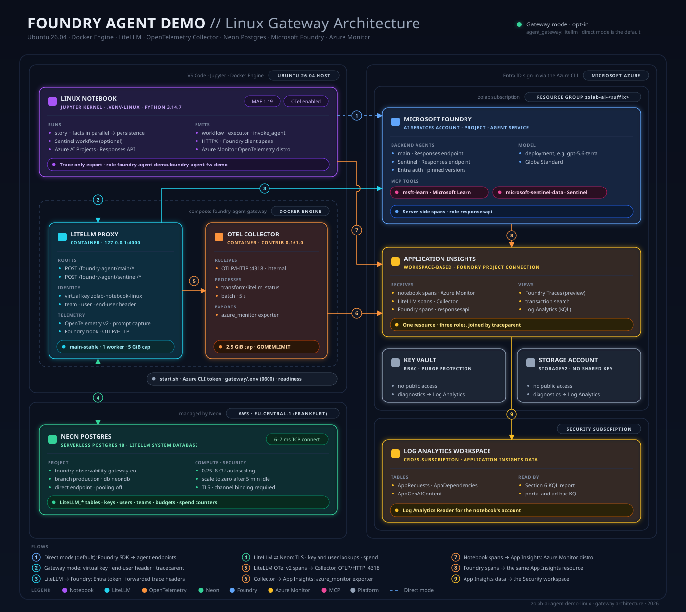
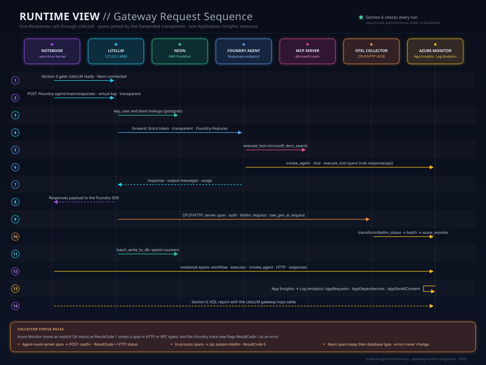
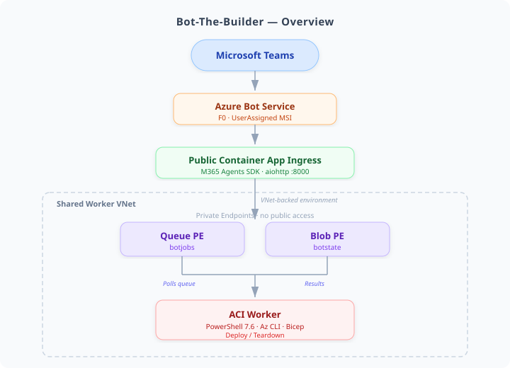

# 🤖 Microsoft Foundry — Agent Framework Observability PoC

Jupyter notebooks that configure and query Microsoft Foundry agents with **end-to-end observability** — tracing agent runs, tool invocations, and responses across Application Insights, Microsoft Foundry Traces, and Log Analytics. The Win11 and Linux notebooks use **Microsoft Agent Framework (MAF) workflows** around their existing Azure AI Projects + Responses API calls. MAF and Foundry share the same OpenTelemetry/Azure Monitor pipeline. Windows requires Python 3.14+; the Ubuntu 26.04 notebook uses **Python 3.14.7** in its own environment, and the separate macOS notebook supports Python 3.13+.


---

<a id="architecture"></a>

## 🗺️ Architecture

The Linux notebook calls the Foundry agents' Responses endpoints directly by
default. With the optional gateway, a LiteLLM proxy and an OpenTelemetry Collector
run as Docker containers on the Ubuntu 26.04 host, and LiteLLM keeps its state in
a Neon Postgres database in AWS Frankfurt. The notebook, the Collector and Foundry
all send their spans to the Foundry project's Application Insights, whose data is
stored in the Security subscription's Log Analytics workspace. Setup and details
are in [Optional LiteLLM Gateway with Neon (Linux)](#optional-litellm-gateway-with-neon-linux).



### Runtime View

One Responses call through the gateway, and how the notebook's, LiteLLM's and
Foundry's spans reach Application Insights:



The [observability guide](docs/observability.md#linux-litellm-gateway-path) shows
the resulting trace as Log Analytics stores it.

---

## 📋 Prerequisites

| Requirement | Details |
|---|---|
| **🏗️ AI Foundry Environment** | Deploy the infrastructure first — see [`deployment/README.md`](deployment/README.md) for full instructions |
| **Azure CLI** | Installed and authenticated (`az login`) — [Install Azure CLI](https://aka.ms/installazurecli) |
| **Entra ID Permissions** | `Contributor` (or equivalent) on the Foundry project and Application Insights resource |
| **Telemetry Read Access** | Log Analytics Reader (or equivalent query permissions) on the workspace linked to Application Insights; activate required PIM roles before the run |
| **Sentinel MCP** | Existing Foundry project connection, OAuth consent, and Sentinel/data-lake access for the signed-in identity; required to run every cell including Section 5.1 |
| **Microsoft Foundry Project** | Connected to an **Application Insights** instance backed by a **Log Analytics workspace** |
| **Model Deployment** | The deployment script offers `gpt-4.1-mini`, `gpt-5.3`, `gpt-5.4`, or `grok-4-1-fast-reasoning`. The notebook can also use an existing compatible deployment, such as `gpt-5.6-terra`, through its local build metadata (see below). |
| **Python** | Python 3.14.7 for Ubuntu 26.04, Python 3.14+ for Win11, or Python 3.13+ for macOS; Linux bootstrap uses `uv`, including on hosts without system `pip`/`ensurepip` |
| **Jupyter Notebook** | VS Code with Jupyter extension or JupyterLab |

---

## 🚀 Quick Start

1. Run the deployment first — it generates `build_info-<suffix>.json` at the repo root (see [`deployment/README.md`](deployment/README.md))
2. Open [the Linux notebook](zolab-ai-agent-demo-linux.ipynb), [the macOS notebook](zolab-ai-agent-demo-macbook.ipynb), or [the Windows notebook](zolab-ai-agent-demo-win11.ipynb)
3. Run **Section 0** — creates `.venv` (Windows/macOS) or `.venv-linux` (Linux) and registers the notebook kernel; first-time Linux setup is below
4. Select the registered kernel: **AI Agent Demo (.venv, Python 3.14)** on Win11 or **AI Agent Demo (Linux, Python 3.14.7)** on Linux
5. Run sections **1 → 5** in order
6. Run **Section 6** and inspect telemetry in the Azure Portal:
   - 📊 **Application Insights** — request/dependency traces
   - 🔍 **Microsoft Foundry** — agent execution traces
   - 📡 **Log Analytics** — span health in `AppDependencies`, conversation/tool content in `AppGenAIContent`, and correlated exception drill-downs
   - **Response accounting and MCP outcomes** — input/output, cached input and reasoning tokens; optional estimates using your supplied prices; approvals, tool errors, request failures and final stage outcomes. See [configuration and interpretation](docs/observability.md#response-usage-cost-estimates-and-mcp-outcomes).

On Windows, Section 1 installs [requirements-notebook.txt](requirements/requirements-notebook.txt) and runs `pip check`. If SDKs were already imported before updating, restart the kernel and rerun from the beginning. The Windows dependency matrix applies to the Windows notebook only; Linux has its own profile below, while the macOS notebook and standalone [Agent Framework SDK PoC](agent-framework-demo/README-agent-framework-sdk-poc.md) have separate setup instructions.

### Ubuntu 26.04 Linux Setup

[zolab-ai-agent-demo-linux.ipynb](zolab-ai-agent-demo-linux.ipynb) uses an isolated
`.venv-linux` and the `ai-agent-demo-linux` kernel. Its environment is defined by
[pyproject.toml](pyproject.toml) and locked, with hashes, in [uv.lock](uv.lock);
neither includes the Windows profiles, Windows-only packages, or Windows wheel-build
scripts. The original Windows/macOS notebooks and the standalone demo are unchanged.

This host has Ubuntu 26.04.1 x86_64, system Python 3.14.4, and `uv`, but no system
`pip` or `ensurepip`. Keep system Python intact: use `uv` to provision the requested
**Python 3.14.7** without adding it to the user's executable directory.
The installed `uv` catalog ends at Python 3.14.6, so setup uses
[official uv download metadata at a fixed revision](https://github.com/astral-sh/uv/blob/716f320609fec9a36b27718be4c403d73fab7c9a/crates/uv-python/download-metadata.json),
including upstream download checksums, rather than silently selecting an older Python.
Install [uv](https://docs.astral.sh/uv/getting-started/installation/) first if it is absent.

For **first-time setup**, run these commands from the repository root:

```bash
uv python install --no-bin --python-downloads-json-url \
  https://raw.githubusercontent.com/astral-sh/uv/716f320609fec9a36b27718be4c403d73fab7c9a/crates/uv-python/download-metadata.json \
  3.14.7
uv venv --python 3.14.7 --no-python-downloads --seed .venv-linux
UV_PROJECT_ENVIRONMENT=.venv-linux uv sync --locked --inexact --no-python-downloads
.venv-linux/bin/python -m pip check
.venv-linux/bin/python -m ipykernel install --user \
  --name ai-agent-demo-linux --display-name "AI Agent Demo (Linux, Python 3.14.7)"
```

If `.venv-linux` already exists, use Section 0 to validate and reuse it instead
of recreating it. An environment with a different Python version must be moved
aside explicitly before setup; the notebook will not overwrite it. Select
**AI Agent Demo (Linux, Python 3.14.7)** in VS Code, then run environment
verification and Section 1. After package changes, restart that kernel and rerun
verification and the runtime cells. Activating a terminal environment does not
switch an already-running notebook kernel.

Azure CLI is a separate system tool, not a notebook Python dependency. If missing,
follow Microsoft's [Ubuntu installation instructions](https://learn.microsoft.com/cli/azure/install-azure-cli-linux?pivots=apt).
This Linux host is verified with **Azure CLI 2.90.0** and the following extensions
(versions checked **2026-09-26**):

| Extension | Version | Purpose |
|---|---|---|
| `log-analytics` | `1.0.0b2` (preview) | KQL queries through `az monitor log-analytics query` |
| `azure-devops` | `1.0.8` | Azure DevOps Services: projects, repos, pipelines, boards, and artifacts |

Install them in the Linux terminal, outside the notebook virtual environment:

```bash
az extension add --name log-analytics --version 1.0.0b2 --allow-preview true --yes
az extension add --name azure-devops --version 1.0.8 --allow-preview false --yes
az extension list --output table
az monitor log-analytics query --help
az devops project list --help
```

There is no extension named `kql` in the official index:
[`log-analytics`](https://learn.microsoft.com/cli/azure/monitor/log-analytics#az-monitor-log-analytics-query)
provides the Azure Monitor KQL query command. Section 6 still uses the Logs API
directly; installing this extension does not change the notebook's telemetry path.
[`azure-devops`](https://learn.microsoft.com/azure/devops/cli/) is the Azure DevOps
extension, not the separate Azure Developer CLI (`azd`). CLI extensions are not
added to `pyproject.toml` or `uv.lock`.

For VS Code Remote/SSH or a headless host, sign in in a terminal **on that Linux host**:

```bash
az login --use-device-code
az account show
```

Use your organization's approved interactive method if device-code authentication
is restricted. The notebook reports missing or expired credentials rather than
starting a hidden interactive login or installing system packages. Existing
deployment metadata, project access, and Sentinel connection/consent requirements
still apply.

### Linux Dependency Matrix

Reviewed on **2026-09-26** for **Ubuntu 26.04.1 / CPython 3.14.7 / x86_64**.
The runtime resolves independently of Windows, uses the latest stable direct
releases where compatible, and retains the Azure Monitor/OpenTelemetry release train.
OpenTelemetry **1.45.0 / instrumentation 0.66b0** are newer but incompatible with
[Azure Monitor 1.8.10's declared bounds](https://pypi.org/pypi/azure-monitor-opentelemetry/1.8.10/json),
so this profile deliberately uses **1.44.0 / 0.65b0**. The tracing bridge,
instrumentation, and Monitor exporter require preview-version packages; the
installer does not enable prereleases globally.

| Package | Version | Notes |
|---|---|---|
| `pip` / `ipykernel` | `26.2.1` / `7.3.0` | Isolated installer and notebook kernel |
| `agent-framework-core` | `1.19.0` | Existing workflows; no extra MAF providers |
| `azure-ai-projects` | `2.7.0` | Foundry agents, project and agent-endpoint Responses clients |
| `openai` | `3.19.2` | Responses and conversations APIs |
| `httpx2` / `httpcore2` | `2.13.1` | Matching transport pair |
| `azure-identity` | `1.25.3` | Stable release instead of the Windows profile's `1.26.0b2` preview |
| `azure-monitor-opentelemetry` | `1.8.10` | Resolves exporter `1.0.0b57` |
| `azure-core-tracing-opentelemetry` | `1.0.0b13` | Azure SDK tracing bridge |
| `opentelemetry-api` / `opentelemetry-sdk` | `1.44.0` | Compatible with Azure Monitor and MAF |
| `opentelemetry-instrumentation-httpx` | `0.65b0` | Includes the HTTPX2 instrumentor |
| `nbclient` / `nbformat` | `0.11.0` / `5.11.1` | Optional validation profile |

- [pyproject.toml](pyproject.toml): the exact direct runtime pins and a
  `validation` dependency group with the notebook validation tools. It requires
  Python 3.14.7, and `tool.uv.environments` limits it to Linux, so uv refuses to
  use it on Windows or macOS. The notebooks and `notebook_support` are not an
  installable package (`package = false`).
- [uv.lock](uv.lock): all 96 packages of the runtime and the validation group,
  including the Linux terminal dependencies `pexpect`/`ptyprocess`, each with its
  PyPI source and SHA-256 hashes. uv checks every download against them. The lock
  holds the same versions as the constraints snapshot it replaces.

Packages install from the public Python Package Index with TLS verification;
unlike Windows, Linux needs no locally built wheels. `--locked` stops instead of
re-resolving when `pyproject.toml` and `uv.lock` disagree, and `--inexact` keeps
packages outside the synced groups, such as the validation tools. Change pins in
`pyproject.toml`, keep the runtime and telemetry train together, then relock
(`uv lock`, or `uv lock --upgrade-package <name>` for one package) and rerun:

```bash
UV_PROJECT_ENVIRONMENT=.venv-linux uv sync --locked --inexact --group validation
.venv-linux/bin/python -m pip check
.venv-linux/bin/python -m unittest discover -s tests -p "test_notebook*.py" -v
```

These tests exercise the real SDKs with in-memory HTTP transports and MAF
callbacks, and cover Linux bootstrap, kernel isolation, authentication errors,
dependency versions, and unchanged workflow/telemetry behavior. They do not
execute paid model calls or verify live Azure permissions and telemetry ingestion.

The standalone Agent Framework demo's tests (`tests/test_agent_framework*.py`)
check that demo's own pins in
[agent-framework-demo/requirements.txt](agent-framework-demo/requirements.txt).
They differ from the Linux notebook's (`openai` 3.16.0 instead of 3.19.2, `httpx2`
2.13.0 instead of 2.13.1), so run them from a separate Linux environment rather
than `.venv-linux` or the demo's Windows `.venv`:

```bash
"$(uv python find 3.14.7)" -m venv agent-framework-demo/.venv-linux
agent-framework-demo/.venv-linux/bin/python -m pip install -r agent-framework-demo/requirements.txt
agent-framework-demo/.venv-linux/bin/python -m pip check
agent-framework-demo/.venv-linux/bin/python -m unittest discover -s tests -p "test_agent_framework*.py" -v
```

The environment is Git-ignored through the `.gitignore` that `venv` writes into
it. Two Windows-only MCP transport tests skip on Linux.

The same environment runs the standalone demo's Linux notebook,
[agent-framework-demo/zolab-agent-framework-sdk-linux.ipynb](agent-framework-demo/zolab-agent-framework-sdk-linux.ipynb),
with the **Agent Framework SDK Demo (Linux, .venv-linux)** kernel that its first
setup cell registers. It shows traces in the Aspire Dashboard container on the
local Docker engine, published on `127.0.0.1`; forward its UI port in VS Code's
**Ports** panel when working over Remote-SSH. See
[Running on Linux](agent-framework-demo/README-agent-framework-sdk-poc.md#running-on-linux).

### Linux Tool-Content Tracing

Section 3.1 enables `OTEL_LOG_TOOL_CONTENT=1` by default for this demo. This
notebook-level option adds correlated MCP observation spans for returned tool
calls, approval requests, and tool discovery in both the main/Learn and Sentinel
response paths. It does not require SDK upgrades or an additional exporter.

Section 6 includes tool-content coverage and optional arguments/result/definition
previews. Observation spans are not measurements of remote tool execution.
The master content policy still applies; `0` disables the additional observations,
and `SHOW_GENAI_CONTENT` controls display. See the
[additions table and complete controls](docs/observability.md#linux-mcp-tool-content-capture).
Restart the kernel and rerun from **Confirm Existing Deployment** after this update.

### Notebook Support Layout

The notebooks stay at the repository root; run their kernels and the commands
below from that directory. Supporting files are grouped by purpose:

```text
notebook_support/
  __init__.py
  agent_endpoints.py
  gateway.py
  observability.py
  response_observability.py
  workflow.py
gateway/
  compose.yaml
  config.yaml
  litellm_callbacks.py
  refresh_runtime_env.py
  provision_identity.py
  start.sh
  smoke-test.sh
  neon-latency.py
  otel-collector.yaml
  .env.example
requirements/
  requirements-notebook.txt
  requirements-notebook-shared.txt
  requirements-notebook-validation.txt
  constraints-notebook-win11.txt
pyproject.toml
uv.lock
docs/
  observability.md
  OTEL-Agent-Spans.md
```

- [notebook_support](notebook_support) is a Python package. Notebook and test
  imports use `notebook_support.agent_endpoints`, `notebook_support.gateway`,
  `notebook_support.observability`, `notebook_support.response_observability`
  and `notebook_support.workflow`; no `sys.path` workaround is needed.
- [gateway](gateway) contains the optional host-local LiteLLM proxy for the Linux
  notebook; see [Optional LiteLLM Gateway with Neon (Linux)](#optional-litellm-gateway-with-neon-linux).
- [requirements](requirements) contains the Windows notebook's dependency profiles
  and constraints; `-r`/`-c` includes remain relative to their requirement files.
  The Linux notebook's environment is [pyproject.toml](pyproject.toml) and
  [uv.lock](uv.lock) at the repository root, independent of the Windows snapshot.
- [docs](docs) contains the [observability guide](docs/observability.md) and
  [span reference](docs/OTEL-Agent-Spans.md).

The standalone Agent Framework demo and bot keep their own requirements in their
existing project directories. After pulling this layout change, restart the
notebook kernel and rerun the runtime cells from **Confirm Existing Deployment**.
Clear outputs before saving or sharing executed notebooks.

The shared [VS Code settings](.vscode/settings.json) suppress Pylint and Pylance
diagnostics for notebooks, while keeping autocomplete/navigation and normal
checks for `.py` files. This does not disable notebook execution errors or the
regression suite. Machine-specific Python search paths remain local.

The workspace [.pylintrc](.pylintrc) keeps the two environments separate when
linting, too. VS Code's Pylint checks every file with the root interpreter, which
does not have the Agent Framework demo's packages, so `.pylintrc` appends the
demo's environment (`agent-framework-demo/.venv-linux` on Linux,
`agent-framework-demo/.venv` on Windows) at the lowest search priority. Root files
still resolve packages from the root environment first; the demo's modules and
tests also resolve `a2a`, `httpx`, `mcp`, `starlette` and `uvicorn`. Nothing is
installed in either environment. The file also tells Pylint that `agent_framework`
exports its names lazily (Pylance reads the package's stubs instead) and exempts
`test_` methods from docstring checks. After pulling, run **Pylint: Restart
Server** from the Command Palette, or reopen a file, to refresh the **Problems**
panel.

### Windows Dependency Matrix

Reviewed on **2026-09-18** using the approved package feed and verified official
GitHub release sources. Recent SDK wheels are built locally when the company
feed has not yet admitted a release; no direct PyPI artifact fallback or
certificate-verification bypass is used.

| Package | Version | Role |
|---|---|---|
| `ipykernel` | `7.3.0` | Notebook kernel |
| `agent-framework-core` | `1.19.0` | Sequential workflow/executor orchestration and native workflow tracing |
| `azure-ai-projects` | `2.6.1` | Foundry project agents, MCP definitions and Responses client |
| `openai` | `3.16.1` | Responses and conversations API; HTTPX2 transport |
| `httpx2` | `2.13.0` | Current compatible transport; matches HTTPCore2 2.13.0 |
| `azure-identity` | `1.26.0b2` | Existing preview credential line retained |
| `azure-monitor-opentelemetry` | `1.8.10` | Azure Monitor exporter configuration |
| `azure-core-tracing-opentelemetry` | `1.0.0b13` | Azure SDK tracing bridge |
| `opentelemetry-api` / `opentelemetry-sdk` | `1.44.0` | Tracing APIs, native resources and the telemetry runtime |
| `opentelemetry-instrumentation-httpx` | `0.65b0` | Includes both HTTPX and HTTPX2 instrumentors, managed by Azure Monitor |

Azure Monitor resolves exporter **1.0.0b57** on the matching OpenTelemetry train. The former `azure-ai-projects<2.5` restriction is removed. Keep the tested SDK versions together rather than independently upgrading the runtime or instrumentation.

### Dependency Profiles

- [requirements-notebook.txt](requirements/requirements-notebook.txt): Windows runtime, including MAF core **1.19.0**. No MAF model-provider package is needed because existing Foundry calls remain unchanged.
- [requirements-notebook-shared.txt](requirements/requirements-notebook-shared.txt): runtime plus optional OpenAI provider **1.14.4**, orchestrations **1.2.0**, and OTLP gRPC exporter **1.44.0**. These are not used by the Windows workflow integration.
- [requirements-notebook-validation.txt](requirements/requirements-notebook-validation.txt): runtime plus `nbclient==0.11.0` and `nbformat==5.11.1` for automated execution and validation.
- [constraints-notebook-win11.txt](requirements/constraints-notebook-win11.txt): 102 version constraints covering the three profiles on Windows / CPython 3.14. Constraints do not install optional packages. This is a version snapshot, not a hash-verified lock, and does not cover other platforms.
- [agent-framework-demo/requirements.txt](agent-framework-demo/requirements.txt): exact direct pins for the standalone Agent Framework notebook, installed into its independent `agent-framework-demo\.venv` and verified by an in-notebook package inventory.

Section 0 also constrains the bootstrap kernel version. Installing the smaller profile does **not** uninstall existing shared packages. Do not prune the shared environment blindly; use a separate environment for a minimal installation. Azure Identity's previously validated preview version is retained, not silently downgraded.

**`pyproject.toml` on Linux, requirements files on Windows:** the Linux notebook
installs everything from the public Python Package Index, so its environment is a
`pyproject.toml` with a hash-verified `uv.lock` (see the
[Linux dependency matrix](#linux-dependency-matrix)). The Windows notebook keeps
these requirements and constraints files:

- On the restricted company feed, it installs wheels built locally from verified
  source commits ([GitHub Release Wheels](#github-release-wheels-for-restricted-package-feeds)).
  Their hashes differ from the published ones, so a hash-verified `uv.lock` would
  reject them.
- It installs with pip, and constraints files pin every transitive dependency
  without installing optional packages. Dependency groups have no equivalent of a
  constraints file.

The Agent Framework demo's
[requirements.txt](agent-framework-demo/requirements.txt) is shared by its Windows
and Linux notebooks, so it also stays a requirements file.

### GitHub Release Wheels for Restricted Package Feeds

After creating the root `.venv`, run:

```powershell
.\build_notebook_wheels.ps1
.\.venv\Scripts\python.exe -m pip install --find-links .\.wheels -r .\requirements\requirements-notebook.txt
.\.venv\Scripts\python.exe -m pip check
```

[build_notebook_wheels.ps1](build_notebook_wheels.ps1) reuses the verified build
engine from the standalone demo, with this notebook's own Python interpreter,
source checkout directory, wheel cache, and
[notebook-source-releases.json](notebook-source-releases.json). It checks official
repository URLs, immutable release commits, clean source, and expected wheel
filenames. SHA-256 hashes and source provenance are written to the ignored root
`.wheels` directory. The script only builds; it does not install packages into
either runtime environment.

Section 1 automatically uses the root `.wheels` cache when present and refuses
to install into the wrong kernel. Restart the **AI Agent Demo (.venv, Python
3.14)** kernel after upgrades. The two notebooks do not share virtual
environments; the Foundry runtime does not inherit A2A/MCP server dependencies
from the standalone demo.

For local validation tooling and the regression suite:

```powershell
.\.venv\Scripts\python.exe -m pip install --find-links .\.wheels -r .\requirements\requirements-notebook-validation.txt
.\.venv\Scripts\python.exe -m unittest discover -s .\tests -p "test_notebook*.py" -v
```

Install the optional shared profile with the same `--find-links .\.wheels`
argument and `-r .\requirements\requirements-notebook-shared.txt` only when additional MAF
providers or an OTLP exporter are needed by other work. The notebook's
`SHOW_GENAI_CONTENT` setting controls report previews independently of capture.
The current notebook opts in; set it to `False` and clear outputs before sharing.

The notebook regression suite includes actual MAF workflow execution with local
callbacks and an in-memory trace exporter: ordering, exactly-once persistence
within one execution, failures, optional Sentinel, and shared trace ancestry.
A runtime/validation-only environment skips the optional provider-profile check. SDK tests use
an in-memory HTTP transport; they do not create cloud resources or execute
paid model calls. Both environments pass `pip check`.

---

## 📓 Notebook Sections

After selecting the platform's registered demo kernel, run sections in order:

| # | Section | What It Does |
|---|---|---|
| **0** | Create or Reuse Virtual Environment | Validates Python 3.14 on Win11 or 3.14.7 on Linux, creates `.venv` or `.venv-linux`, installs `ipykernel`, and registers the platform's Jupyter kernel |
| **1** | Install Dependencies | Installs the constrained MAF core, Foundry, Azure Identity and Azure Monitor/OpenTelemetry runtime profile |
| **2** | Import Libraries | Verifies the Foundry clients, workflow helper and native OpenTelemetry `Resource` imports |
| **3** | Configure Credentials and Clients | Reuses deployment values from `build_info-<suffix>.json`, resolves Azure auth, and configures the Foundry project client plus Responses API settings |
| **3.1** | Enable Telemetry | Configures one Azure Monitor/OpenTelemetry provider for MAF, Foundry and HTTP tracing, with shared capture and propagation controls |
| **3.2** | Configure MSFT Learn MCP Tool | Attaches the [Microsoft Learn MCP endpoint](https://learn.microsoft.com/api/mcp) directly to the Foundry project agent |
| **3.3** | Configure Microsoft Sentinel MCP Tool | Preserves the existing Foundry project-connection dependency for the Sentinel MCP tool |
| **4** | Prepare the Agents | In backend sync mode, creates/reuses and activates the matching definition version; strict pinned mode validates only; project mode creates agent versions as before |
| **5** | Query the Agent | Runs the story/facts/persistence MAF workflow around the existing Responses calls; saves results and generates a Marp deck |
| **5.1** | Query Microsoft Sentinel | Runs an optional independent MAF workflow while preserving Sentinel's MCP dependency path |
| **6** | Validate Telemetry | Flushes traces, waits for ingestion, then validates workflow/executor coverage, span ancestry, dependencies, failures, service identity and version; reads the report's Log Analytics views concurrently, five at a time |

For bot and worker post-deploy validation, run [deployment/run-smoke-checks.sh](deployment/run-smoke-checks.sh) and then exercise the manual Teams smoke sequence from [deployment/OPERATIONS-RUNBOOK.md](deployment/OPERATIONS-RUNBOOK.md).

### Viewing Styled Marp Decks on Linux

Install and enable **Marp for VS Code** (`marp-team.marp-vscode`) on the machine
or Remote/SSH host where the Markdown preview runs. It is included in the
[workspace extension recommendations](.vscode/extensions.json). Without this
renderer, the generated files appear as ordinary Markdown instead of slides.

Open the generated file from [marp](marp), then choose **Open Preview to the Side**
(`Ctrl+K V`). If a preview was already open when the extension was installed,
close and reopen it, or run **Developer: Reload Window**.

The Linux generators preserve the Win11 presentation exactly:

- **Main deck:** dark blue gradient; title, fictional story, Microsoft Learn
  insights, and run metadata on four separate slides.
- **Sentinel deck:** rustic orange-to-dark gradient; title, Sentinel result,
  and run metadata on three separate slides.
- Both retain slide-specific classes, pagination, and the verified model footer.

No new agent run is required to preview an existing deck. The notebook's original
title and Microsoft logo are rendered as a native Markdown heading so the title
is also visible in the notebook outline. An inline style gives the title the
Windows notebook's purple (`#4A2D6F`) and 800 font weight, and the logo its
rounded corners.

### Model Metadata in Marp Outputs

Both the main story/Learn deck and the Sentinel deck display a footer on every
slide with **LLM type/provider**, **model name**, and **model version**. For the
current deployment, these are `OpenAI`, `gpt-5.6-terra`, and `2026-07-09`.
The run-metadata slide lists the deployment alias and response model identifiers
separately; neither is confused with the agent version.

Section 4 resolves the underlying model metadata once through
`project_client.deployments.get`. Sections 5 and 5.1 validate the response model
against that snapshot and persist it with each record's `model_metadata`.
Missing deployment metadata or an unexpected response model raises an explicit
error rather than displaying guessed values. Rerun **Section 4**, then **5 and
5.1**, to regenerate both decks with the footer after updating the notebook.

### Backend Agent Endpoints

The Windows and Linux notebooks support two explicit invocation modes through
[notebook_support/agent_endpoints.py](notebook_support/agent_endpoints.py):

- **`project`**: the backward-compatible project Responses endpoint with an
  `agent_reference`. This remains the default for build files without migration
  settings.
- **`agent_endpoint`**: separate stable Responses endpoints for the main and
  Sentinel backend agents. Requests do not send an `agent_reference` override;
  each endpoint's pinned version selects the agent.

The backend-only migration uses the existing project, model and MCP connection.
It does not publish to Teams/M365, provision a hosted-agent container, or change
the caller's authentication method.

The local build metadata selects the mode and fixed versions:

```json
{
  "agent_invocation_mode": "agent_endpoint",
  "backend_version_policy": "sync",
  "backend_agents": {
    "main": {"name": "ZoDEfendersAgent-1702-backend", "version": "2"},
    "sentinel": {"name": "ZoDEfendersAgent-1702-sentinel-backend", "version": "2"}
  }
}
```

These fields supplement the existing build file; do not replace its other values.
The metadata file remains Git-ignored. Backend endpoints require a unique
identity, an enabled Responses endpoint with Entra authorization and a single
100% fixed-version selector. Version handling is explicit:

- **`sync` (selected for this demo):** Section 4 compares the notebook definition
  with the actual active version. It reuses the active version when unchanged,
  reuses a matching latest candidate if available, or calls `create_version`.
  It verifies the returned definition, pins the endpoint to that concrete version,
  reads the endpoint back, and saves the selected version to the local build file
  and in-memory runtime. The example version values above are checkpoints, not
  permanent restrictions. Rerunning unchanged definitions does not create or
  reactivate versions.
- **`pinned` (default when no policy is specified):** read-only validation retains
  the stricter release workflow. A definition or pin mismatch raises rather than
  creating/promoting. Use this for consumers that require separate release approval.

Set `FOUNDRY_AGENT_VERSION_POLICY` to override the local policy explicitly.
**Sync activation changes behavior for every consumer of that agent endpoint.**
It does not enable `@latest`, delete older versions, change identities/endpoints,
or remove authorization. Do not run competing releases concurrently: the helper
checks for endpoint changes before activation but cannot make service updates
and local file persistence one atomic transaction.
Sync verifies the definition and endpoint state, not a full evaluation suite
before activation. Use `pinned` when a release must pass separate approval.

For strict releases, create and test a candidate separately, then update both
the endpoint selector and the local selected version. For rollback to the legacy path, set
`FOUNDRY_AGENT_INVOCATION_MODE=project` before restarting the kernel and rerunning
from Section 3, or set `agent_invocation_mode` to `project` in the local build
file. The legacy agent names and invocation path are retained. Start new
conversations after switching modes; conversation portability is not assumed.
An agent-version pin does not freeze changes made directly to the underlying
model deployment or external MCP service; those remain separate change controls.

If activation succeeds but saving local metadata fails, the error reports the
active version and does not pretend the run succeeded. Resolve the file error and
rerun sync: it reconciles the checkpoint without creating another version.
Concurrent local file changes are detected before replacement; unrelated build
metadata is preserved. Start new conversations when you activate changed behavior.
Synchronization is per agent: if a later agent fails, an earlier successful
activation remains recorded and can be reused on the next run.

**Version-sync fix validation:** run `447909c6-f671-4146-bade-cf841fd3644a`
successfully created and activated version 2 of both backend agents from the
edited notebook definitions, persisted both selections and completed all 10
runtime cells with no failures. Two additional unchanged sync rounds per agent
were tested with create/update operations blocked: version 2 was reused and the
build file was not rewritten. Version 1 and the original identities were retained.
All 80 regression tests passed.

The project metadata is regenerated by environment deployment scripts; preserve
or reapply these local migration settings when regenerating it. Other notebooks
have not automatically been migrated by adding these Windows runtime settings.

**Validated migration:** run `b4591fc5-2289-4527-8e81-a9e97e153f34` used the saved
backend configuration without injected settings and passed all 10 runtime cells.
It exercised story generation, Learn MCP, Sentinel `SigninLogs`, persistence and
model metadata. Its inventory contained 54 correlated spans, seven Responses
dependencies, one persistence span and zero failures. All 65 regression tests
passed. The original agents remained unchanged, and anonymous requests to both
new endpoints returned HTTP 401.
Both exported Marp decks were also checked in the browser: all seven slides
retained the model footer without clipping/overlap and showed the backend runtime
label on the metadata slide.

### Optional LiteLLM Gateway with Neon (Linux)

The Linux notebook can send both backend agents' Responses traffic through a
host-local [LiteLLM](https://docs.litellm.ai/) proxy in [gateway](gateway), backed
by a [Neon](https://neon.com/) Postgres database
([details](#neon-postgres-for-the-gateway)). Direct calls to Foundry remain the
default. The [architecture and runtime diagrams](#architecture) at the top of this
README show both modes. The notebook calls the gateway with a LiteLLM virtual key that
`start.sh` provisions for the signed-in account and a demo team
([Identity](#litellm-identity)); the master key is kept for administration. Spend
logs are disabled, and no budgets or rate limits are set.

```text
Linux notebook --(virtual key, end-user header, traceparent)--> LiteLLM 127.0.0.1:4000
    /foundry-agent/main/*     --> main agent endpoint     (Entra token)
    /foundry-agent/sentinel/* --> Sentinel agent endpoint (Entra token)
    LiteLLM --(TLS)--> Neon Postgres (AWS eu-central-1, Frankfurt)
    LiteLLM --(OTLP)--> OpenTelemetry Collector --> Application Insights
```

- **Routes:** [gateway/config.yaml](gateway/config.yaml) defines one authenticated
  `POST` pass-through route per agent endpoint, covering `/conversations` and
  `/responses`. LiteLLM's `azure_ai/agents` provider expects Assistants-style
  `asst_` IDs and rejects the named agent endpoints, so the routes pass Foundry
  Responses payloads, including MCP approvals, through unchanged.
- **Trace context:** Foundry's server-side `responsesapi` service emits the GenAI
  `chat` spans that Section 6 requires. Both routes set `forward_headers: true`
  so `traceparent`, `baggage` and `Foundry-Features` reach Foundry unchanged; the
  configured Entra token still replaces the client's LiteLLM key.
- **LiteLLM traces:** LiteLLM uses its [OpenTelemetry v2](https://docs.litellm.ai/docs/observability/opentelemetry_v2)
  tracing (`LITELLM_OTEL_V2=true`) and exports its spans over OTLP to a pinned
  OpenTelemetry Collector ([gateway/otel-collector.yaml](gateway/otel-collector.yaml)),
  which forwards them to the Foundry project's Application Insights, the same
  resource as the notebook. `start.sh` resolves that connection string from the
  project and passes it only to the Collector. Each request produces one server
  span in `AppRequests`, named `POST /foundry-agent/<agent>/<operation>` and
  parented to the notebook's request through `traceparent`, under the role
  `foundry-agent-demo.litellm-gateway`. Its children in `AppDependencies` are
  `auth <path>`, with the Neon lookups nested under it as `postgres get_*` spans;
  `chat <model>`, LiteLLM's call to the Foundry agent; and
  `batch_write_to_db _PROXY_track_cost_callback`, which flushes spend counters to
  Neon. Foundry's spans remain children of the notebook's request, beside
  LiteLLM's. Section 6 therefore reads `AppRequests`
  as well as `AppDependencies`, so gateway spans correlate to their interaction
  and appear in the span inventory with the category `llm-gateway`,
  and it adds a **LiteLLM gateway hops** table with client, gateway, upstream,
  overhead and Foundry `invoke_agent` timings for every gateway request.
- **LiteLLM span content:** OpenTelemetry v2 records no prompts or results unless
  you opt in. This demo opts in with
  `OTEL_INSTRUMENTATION_GENAI_CAPTURE_MESSAGE_CONTENT=span_only`, and
  `turn_off_message_logging: false` keeps them in LiteLLM's logging payload, like
  the notebook's demo content policy, so prompts and results may be sensitive.
  Generic pass-through routes give LiteLLM no provider, model, messages, output,
  usage or cost. [gateway/litellm_callbacks.py](gateway/litellm_callbacks.py)
  therefore runs as a LiteLLM `async_logging_hook`, which LiteLLM calls before the
  `otel` callback, and fills the payload fields that the v2 mappers read from the
  Foundry request and response. On `chat <model>`:

  | Field | Value |
  |---|---|
  | `gen_ai.provider.name`, `gen_ai.system` | `microsoft.foundry`, the value that Foundry's own spans in the trace report |
  | `gen_ai.operation.name` | `chat` |
  | `gen_ai.request.model` | The agents' model deployment from the build file, such as `gpt-5.6-terra` |
  | `gen_ai.response.model`, `gen_ai.response.id` | The model and the response or conversation ID that Foundry returns |
  | `litellm.provider.model` | `azure_ai/<model>`, with LiteLLM's provider ID for Microsoft Foundry |
  | `gen_ai.input.messages` | The request's instructions, as a system message, and its input, in the OpenTelemetry GenAI message format. MCP approval responses are `mcp` parts |
  | `gen_ai.output.messages` | The response's text, and its MCP calls, tool list and approval requests as `tool_call` parts, without the tool output |
  | `gen_ai.response.finish_reasons` | `stop`; `tool_call` while an MCP approval is pending; `length`, `content_filter` or `error` for incomplete or failed responses |
  | `gen_ai.usage.input_tokens`, `gen_ai.usage.output_tokens`, `gen_ai.usage.cache_read.input_tokens` | Responses API token usage, including cached input tokens, and the older `gen_ai.usage.prompt_tokens`, `completion_tokens` and `total_tokens` names |
  | `litellm.cost.total` | The cost estimated from LiteLLM's `azure/<model>` prices, including cached-token pricing |
  | `server.address`, `server.port` | The Foundry agent endpoint |
  | `litellm.call_type`, `litellm.request.route`, `litellm.call_id` | `pass_through_endpoint`, the LiteLLM route template and LiteLLM's call ID |

  The server span and every span after authentication also carry the virtual
  key's identity; see [Identity](#litellm-identity). A conversation create sends no
  input, so its `chat` span records no messages. Application Insights stores the
  messages in `AppGenAIContent`, like the notebook's and Foundry's, and truncates
  each property value at 8,192 characters. OpenTelemetry v1's `litellm_request`
  and `raw_gen_ai_request` spans and its `hidden_params` and `metadata.*`
  attributes are gone; their fields map to the attributes above.
- **Span status:** OpenTelemetry v2 leaves a successful span's status unset; this
  demo reports OK, like the notebook's own spans. For spans that it does not
  recognize as HTTP or RPC, the Azure Monitor exporter stores OK as `ResultCode` 1,
  which the Foundry trace view flags as an error even though `Success` is true. The
  Collector's `transform/litellm_status` processor therefore sets OK together with
  protocol context. LiteLLM's server span has stable HTTP attributes
  (`OTEL_SEMCONV_STABILITY_OPT_IN=http`), so `ResultCode` is the HTTP status; on the
  POST-only agent routes the processor replaces the catch-all route template
  `/foundry-agent/<agent>/{subpath:path}` with the request path, so each request is
  named after its operation. `auth` and `chat` get `rpc.system=litellm`, so
  `ResultCode` is 0 and their names are kept. The Neon spans are database-typed and
  keep the unset status, since Azure Monitor derives their `ResultCode` from it.
  Error statuses are never changed.
- **Start and refresh:** run `gateway/start.sh` from the repository root. It
  resolves both agent endpoints from `build_info-*.json`, obtains an Entra token
  from the Azure CLI session, writes the Git-ignored `gateway/.env` (mode `0600`),
  starts the container and fails unless LiteLLM is healthy and Neon is connected.
  Because `docker compose up -d` ignores edits to bind-mounted files, it also
  restarts LiteLLM when `config.yaml` or `litellm_callbacks.py` changed after it
  started, and the Collector when `otel-collector.yaml` did. It then provisions
  the notebook's LiteLLM identity ([Identity](#litellm-identity)); those lookups
  appear in Application Insights as short standalone requests, such as
  `GET /key/list`, outside the notebook's traces.
  Section 3 of the notebook reruns it automatically when needed; see
  [Token refresh](#token-refresh). A refresh recreates the LiteLLM container, so
  avoid running it by hand during a notebook run. Keys that `start.sh`
  does not manage, such as a hand-added `NEON_API_KEY`, are kept when the file is
  rewritten. `gateway/smoke-test.sh` checks both routes.
- **Neon:** LiteLLM keeps its state in Neon Postgres. The project, its location,
  credentials and observability are described in
  [Neon Postgres for the gateway](#neon-postgres-for-the-gateway).
- **Memory caps:** [gateway/compose.yaml](gateway/compose.yaml) caps LiteLLM at
  5 GiB of RAM (`mem_limit: 5g`), above LiteLLM's 4 GiB per-worker guidance for its
  single worker, and the Collector at 2.5 GiB (`mem_limit: 2560m`). After a
  restart they used about 0.5 GiB and 30 MiB. `docker stats` shows current usage
  against each cap. A container that exceeds its cap is killed and restarted by
  its `unless-stopped` policy.
- **Notebook opt-in:** add `"agent_gateway": "litellm"` to the local build file or
  set `FOUNDRY_AGENT_GATEWAY=litellm`; the environment variable wins. Section 3
  prints the route, then checks the gateway before any agent call with
  `ensure_gateway_ready`: LiteLLM is ready, Neon is connected, at least 10 minutes
  of token lifetime remain, both containers are running, neither container's
  mounted files changed after it started, the Collector config keeps the status
  rules, and the LiteLLM container runs with `LITELLM_OTEL_V2=true`, prompt capture
  and stable HTTP attributes from `compose.yaml`. When `gateway/start.sh` fixes the
  problem, as it does for an expiring token or a stopped or stale container,
  Section 3 runs it, shows its output and checks again
  ([Token refresh](#token-refresh)); other problems, such as missing Collector
  status rules or an unavailable Docker engine, stop the notebook with guidance.
  It prints `Gateway telemetry` and warns,
  without stopping, about export failures logged in the last 30 minutes, then
  prints `Gateway identity`: the virtual key and end user, or a master-key
  fallback. The notebook keeps the Foundry SDK client and changes only its base
  URL, API key and the `x-litellm-end-user-id` header
  ([notebook_support/gateway.py](notebook_support/gateway.py)). Responses spans
  carry `app.gateway.name=litellm` and `app.upstream.server.address`. Agent
  preparation and deployment lookups still call Foundry directly. Set
  `agent_gateway` to `direct`, or remove it, to switch back.
- **Deployment table:** **Confirm Existing Deployment** ends with three gateway
  rows. 🚦 **LiteLLM Gateway** shows readiness, address and the Foundry token's
  remaining minutes. 🔭 **OTEL Collector** shows the Collector container's image
  version and uptime, and that it exports to App Insights; it shows ⚠️ when
  `otel-collector.yaml` changed after the Collector started or lacks the status
  rule. 🐘 **Neon DB** shows the
  connection state, database and AWS region, without hostnames or credentials.
  Direct mode shows `➖ Not used`. A row marked ❌ or ⚠️ replaces the "all green"
  headline; the cell reports problems without raising, and Section 3 remains the
  enforcing check.
- **Section 3.1:** in gateway mode the tracing summary adds LiteLLM gateway
  tracing (the `foundry-agent-demo.litellm-gateway` role and the `llm-gateway`
  category, with prompts, results, token usage and cost), the OTEL Collector's
  status and export target, and Neon's status. LiteLLM's `postgres` and
  `batch_write_to_db` spans time its Neon queries. Direct mode shows `Not used`.

#### Token refresh

LiteLLM sends the same Microsoft Entra token for every call to Foundry, and reads
it once, when its container starts. `start.sh` gets that token from the Azure CLI
session. Entra gives it a lifetime of 60–90 minutes, and the Azure CLI keeps
returning its cached token until fewer than five minutes remain, so running
`start.sh` earlier returns the same token.

Section 3 therefore refreshes the gateway itself when the token has less than the
10 minutes a notebook run needs:

- **Expired, or under 5 minutes left:** it runs `gateway/start.sh` at once, which
  gets a new token and recreates the LiteLLM container with it.
- **5 to 10 minutes left:** it first waits until the Azure CLI stops reusing the
  token, at most about five minutes, then runs `start.sh`.
- **A stopped or stale container:** it runs `start.sh` without waiting.

`start.sh` output appears in the cell, after a `Gateway refresh` line that gives
the reason. Section 3 then reloads `gateway/.env` and checks again; if the gateway
is still not usable, it stops with the reason instead of retrying. If the Azure CLI
session itself has expired, the error asks you to run `az login --use-device-code`
in the host's terminal. A gateway configured with `FOUNDRY_AGENT_GATEWAY_ENV_FILE`
outside `gateway/.env` is not refreshed automatically, because `start.sh` writes
only `gateway/.env`.

A longer token lifetime is not something the notebook or the Azure CLI can
request. A Microsoft Entra administrator can set an access-token lifetime from
10 minutes to one day with a
[token lifetime policy](https://learn.microsoft.com/entra/identity-platform/configurable-token-lifetimes),
for the whole organization or for specific service principals. That changes token
lifetimes beyond this demo, and a longer-lived token in `gateway/.env` stays usable
longer if it leaks, so the demo refreshes instead.

#### LiteLLM identity

After LiteLLM is healthy, `start.sh` runs
[gateway/provision_identity.py](gateway/provision_identity.py), which uses the
master key to create or reuse:

- the team `foundry-agent-demo` ("Foundry Agent Demo");
- an internal user for the signed-in Azure CLI account, read from the Entra
  token's `upn` claim and stored in `gateway/.env` as `LITELLM_USER_ID` and
  `LITELLM_USER_EMAIL`;
- the virtual key `zolab-notebook-linux` for that user and team. The key may call
  only `/foundry-agent/main` and `/foundry-agent/sentinel`: LiteLLM requires
  `allowed_passthrough_routes` before a virtual key can use an `auth: true`
  pass-through route. It is written to `gateway/.env` as `LITELLM_NOTEBOOK_KEY`
  and never printed. A valid key is reused on later runs.

Lookups use LiteLLM's list endpoints, which return empty results instead of 404s,
so a first run records no failed requests in Application Insights, and a lookup
is retried if Neon or LiteLLM briefly fails.

No budgets or rate limits are set. The notebook sends the key and the
`x-litellm-end-user-id` header (`LITELLM_END_USER_ID`, the same account by
default). Once a request is authenticated, OpenTelemetry v2 adds the key's identity
to the server span and every later LiteLLM span (`chat`, `batch_write_to_db`):
`litellm.metadata.user_api_key_alias`, `litellm.metadata.user_api_key_user_id`,
`litellm.metadata.user_api_key_end_user_id`, `litellm.team.id`,
`litellm.team.alias` and `litellm.api_key.hash`. The Neon lookups made during
authentication run before the key is known and carry none of them. v2 does not
record the user's e-mail address or the key's spend on spans, and organizations
and projects are LiteLLM Enterprise features. Without `LITELLM_NOTEBOOK_KEY` the
notebook falls back to the master key. Looking up the virtual key's user, team and
end user adds `postgres get_*` spans against Neon to each request.

#### Container settings

[gateway/compose.yaml](gateway/compose.yaml) sets these telemetry-related
environment variables:

| Container | Variable | Value | Effect |
|---|---|---|---|
| litellm | `OTEL_EXPORTER`, `OTEL_ENDPOINT` | `otlp_http`, `http://otel-collector:4318/v1/traces` | Export spans to the Collector |
| litellm | `OTEL_SERVICE_NAME`, `OTEL_RESOURCE_ATTRIBUTES` | `litellm-gateway`, `service.namespace=foundry-agent-demo` | Role `foundry-agent-demo.litellm-gateway` in App Insights |
| litellm | `OTEL_ENVIRONMENT_NAME` | `demo`, overridable in `gateway/.env` | `deployment.environment`; LiteLLM's default is `production` |
| litellm | `LITELLM_OTEL_V2` | `true` | LiteLLM's OpenTelemetry v2 tracing; it joins the notebook's traces through `traceparent` |
| litellm | `OTEL_INSTRUMENTATION_GENAI_CAPTURE_MESSAGE_CONTENT` | `span_only` | Opts in to prompts and results as span attributes; v2 records none by default |
| litellm | `OTEL_SEMCONV_STABILITY_OPT_IN` | `http` | Stable HTTP attributes on the server span, which Azure Monitor needs to store it as an HTTP request with its status code |
| litellm | `LITELLM_OTEL_INTEGRATION_ENABLE_EVENTS`, `LITELLM_OTEL_INTEGRATION_ENABLE_METRICS` | `false` | GenAI log events and metrics would need Collector logs and metrics pipelines; usage and content are on the spans |
| litellm | `FOUNDRY_MODEL_DEPLOYMENT` | `genai_model` from the build file | `gen_ai.request.model` |
| otel-collector | `APPLICATIONINSIGHTS_CONNECTION_STRING` | From the Foundry project | Azure Monitor export target |
| otel-collector | `GOMEMLIMIT` | `2048MiB` | Go garbage-collection target, about 80% of the 2.5 GiB cap |

OpenTelemetry v2 always uses the current GenAI conventions (`chat <model>`,
`gen_ai.provider.name`) and adds the older `gen_ai.system` and token-count names.
`OTEL_INSTRUMENTATION_GENAI_CAPTURE_MESSAGE_CONTENT` also accepts `span_and_event`,
whose events would need a Collector logs pipeline.

#### Neon Postgres for the gateway

**Neon Console:** [console.neon.tech](https://console.neon.tech). Sign in, then
open the project [foundry-observability-gateway-eu](https://console.neon.tech/app/projects/silent-river-13598320).

[Neon](https://neon.com/) is a managed, serverless Postgres service that runs on
AWS. It separates storage from compute, autoscales compute between set limits,
and scales an idle compute to zero after 5 minutes, waking it on the next
connection. In this project, Neon is the LiteLLM gateway's system database only.
The notebook, Foundry and the Collector never connect to it.

| Item | Value |
|---|---|
| Console | [console.neon.tech](https://console.neon.tech) → project `foundry-observability-gateway-eu` |
| Project ID | `silent-river-13598320` |
| Cloud and region | AWS `aws-eu-central-1` (Europe, Frankfurt) |
| Latency from the gateway host | 6–7 ms median TCP connect, from `gateway/neon-latency.py` |
| Branch / database / role | `production` (default) / `neondb` / `neondb_owner` |
| Postgres version | 18 |
| Compute | Read-write endpoint, 0.25–8 CU autoscaling, scale to zero after 5 minutes idle |
| Connection | Direct endpoint (connection pooling off) with `sslmode=require` and `channel_binding=require` |
| History | Created 2026-09-27. It replaced the original `aws-us-east-2` (Ohio) project, about 116 ms away, which was deleted after the switch |

**How LiteLLM uses Neon**

- LiteLLM reads the connection string from `DATABASE_URL` in the Git-ignored
  `gateway/.env` (mode `0600`). Only the LiteLLM container receives it, and it is
  never committed.
- On every start, LiteLLM runs `prisma migrate deploy`, which creates or upgrades
  its `LiteLLM_*` tables. Migrations need the direct endpoint; Neon's `-pooler`
  endpoint runs PgBouncer in transaction mode, which migrations cannot use.
- Neon stores LiteLLM's key, user, team and budget records and periodically
  flushed spend counters. With `disable_spend_logs: true` there are no
  per-request spend logs, and with message logging off, no prompts or responses
  are written.
- Before forwarding a request, LiteLLM checks cached user and budget data. When
  that cache has expired, it queries Neon first, which is why the region matters.
  Moving from Ohio to Frankfurt cut this check from about 125 ms to a median of
  about 14 ms (8–48 ms across four spaced requests). If Neon is unreachable,
  LiteLLM logs `Budget lookup failed for user` and forwards anyway; this happened
  once, as a 4.0 s wait.
- `gateway/start.sh` fails unless LiteLLM's readiness endpoint reports
  `db: connected`, and notebook Section 3 checks the same status before any agent
  call (`Gateway health: LiteLLM ready, Neon connected`).

**Manage credentials and region**

- **Connection string:** Neon Console → project → **Connect** → branch
  `production`, database `neondb`, role `neondb_owner` → turn **Connection
  pooling** off → copy. Then run `gateway/start.sh --prompt-database-url`; the
  value is not echoed. Resetting the role password or claiming a project rotates
  the string.
- **Region:** `gateway/neon-latency.py` reports the configured database's region
  and ranks every Neon region by latency from this host. A project's region is
  fixed. To move, create a new project in the closest region (**New project** →
  region), switch with `gateway/start.sh --prompt-database-url`, confirm with
  `gateway/neon-latency.py`, then delete the old project. LiteLLM recreates its
  schema; no data needs copying while spend logging and usage limits are off.
- **API key (optional):** a hand-added organization key, `NEON_API_KEY` in
  `gateway/.env`, enables Neon API operations such as listing or deleting
  projects. `start.sh` keeps it, and neither container receives it. Create or
  revoke it in the Neon Console: switch to your organization, then go to
  **Settings → API keys**.

**How Neon appears in the traces**

Neon sends no telemetry to Application Insights. Its work shows up in LiteLLM's
OpenTelemetry v2 spans, which follow this path:

```text
LiteLLM otel callback (v2) --OTLP/HTTP--> OpenTelemetry Collector (gateway/otel-collector.yaml)
  --azure_monitor exporter--> Application Insights (same resource as the notebook)
  --> Log Analytics AppRequests + AppDependencies --> notebook Section 6
```

| Signal | Where to look | What it shows about Neon |
|---|---|---|
| `postgres get_*` spans | `AppDependencies`, dependency type `postgresql`, role `foundry-agent-demo.litellm-gateway`, nested under `auth <path>` | LiteLLM's virtual-key lookups, such as `postgres get_user_object`, `get_end_user_object` and `get_team_membership`, with their duration |
| `batch_write_to_db _PROXY_track_cost_callback` span | `AppDependencies`, dependency type `postgresql`, category `llm-gateway` | LiteLLM queuing the request's spend update for its periodic batched write to Neon. The span times the queuing, typically under 2 ms, not the later background flush |
| Time outside `chat <model>` within the gateway request | Section 6 **LiteLLM gateway hops**, `GatewayOverheadMs` | Includes the Neon lookups on a cache miss |
| Gateway readiness `db` | `gateway/start.sh` output and Section 3 `Gateway health` | Whether LiteLLM can reach Neon |
| LiteLLM logs | `docker compose --project-directory gateway --env-file gateway/.env logs litellm` | Neon connection errors, such as `Budget lookup failed for user` |
| Neon **Monitoring** | Neon Console → project → **Monitoring** | Database-side connections, compute and CPU; not exported to Application Insights |

This query lists the gateway's recent batched-write spans, one per gateway request:

```kusto
AppDependencies
| where TimeGenerated > ago(6h)
| where AppRoleName == "foundry-agent-demo.litellm-gateway" and Name startswith "batch_write_to_db"
| project TimeGenerated, OperationId, ParentId, DurationMs
| order by TimeGenerated desc
```

Each row's `OperationId` is the notebook trace that the gateway request belongs to,
so it can be opened in the Application Insights end-to-end transaction view.

**Validated gateway run:** run `be4d66dc-840f-4b4a-813f-8e9908123210` routed 3
conversations and 8 Responses requests (5 main and 3 Sentinel, including 5 MCP
approval rounds) through LiteLLM with no gateway errors. Section 6 passed with
zero failed spans; all 8 notebook Responses spans carried the gateway tag, and 13
Foundry server-side `chat` spans joined the run's traces.

**Validated OpenTelemetry v2 run:** run `1ed347d9-29a9-4896-88d2-8c95b6c32114`
(trace `508035eaf6ae3d783503b2348c9126ea`) passed Section 6 with 209 spans across
the notebook, LiteLLM and Foundry, none failed and none with `ResultCode` 1. Its 11
gateway requests produced 101 LiteLLM spans: 11 `POST /foundry-agent/...` requests
with `ResultCode` 200 and `STATUS_CODE_OK`; 11 `auth` and 11 `chat gpt-5.6-terra`
spans with `ResultCode` 0 and `STATUS_CODE_OK`; and 57 `postgres get_*` and 11
`batch_write_to_db` spans that kept the unset status. The 8 Responses calls'
`chat` spans carried input and output messages, and every request, `chat` and
`batch_write_to_db` span carried the virtual key alias `zolab-notebook-linux` and
the team `Foundry Agent Demo`.

**Validated gateway traces (OpenTelemetry v1):** run `ac32240c-641c-4bac-ace4-70f5b1848ff2` passed
Section 6 with LiteLLM tracing enabled. All 11 gateway requests (3 conversations
and 8 Responses calls) returned HTTP 200, and all 34 LiteLLM spans (11 requests
and 23 children) correlated to story, facts or Sentinel with zero failures.
LiteLLM added about 2 ms before forwarding most Responses calls. Requests after a
few idle seconds spent about 120 ms, one round trip to the original `aws-us-east-2`
Neon project from this host, on a database-backed budget lookup; moving the
database to Frankfurt later reduced this to a median of about 14 ms. One Sentinel
call waited 4.0 s when LiteLLM briefly could not reach Neon (`Budget lookup failed
for user`) before continuing. No time was added after the upstream call returned.
[tests/test_notebook_gateway.py](tests/test_notebook_gateway.py) covers
configuration, routing, readiness failures, SDK headers, trace export, the
telemetry pre-flight and notebook wiring without live calls.

**Validated span status fix (OpenTelemetry v1):** in trace `67b4f4c415213e2d8d2aea8880beb288` the
Foundry trace view flagged 16 errors. They were exactly the 16 LiteLLM spans (5
requests and 11 children), each with `ResultCode` 1 and `otel.status_code`
`STATUS_CODE_OK`, while `Success` was true, every gateway request returned HTTP 200
and Section 6 passed, so neither the token nor routing was at fault. LiteLLM's rows
were the only ones in the workspace with that code; Foundry's own `responsesapi`
spans record 0. The first fix reset OK to unset. The Collector now keeps OK and
adds protocol context instead ([Span status](#optional-litellm-gateway-with-neon-linux)).

**Validated span content (OpenTelemetry v1):** probe trace `854b89ba9078c63307dcc4af76b64f37` sent a
conversation and a Responses call through the virtual key. `litellm_request`
recorded `STATUS_CODE_OK` with `ResultCode` 0, `gen_ai.system=azure_ai`,
`gen_ai.request.model=gpt-5.6-terra`, `litellm.provider.model=azure_ai/gpt-5.6-terra`,
the key alias, team and end user, the input and output messages, and an
estimated cost of $0.001882 for 896 tokens. Both gateway requests were
`POST /foundry-agent/main/...` with `ResultCode` 200 and `STATUS_CODE_OK`, and
every span had `Success` true.

---

## 🔑 Key Configuration

### Build-Time Notebook Configuration

The deployment script writes a repo-local `build_info-<suffix>.json` file at build time. The notebooks read the latest matching file in the **Confirm Existing Deployment** section and reuse it in **Section 3** to populate:

- `foundry_proj_ep` → the Microsoft Foundry project endpoint
- `genai_model` → the model deployment name used when creating both notebook agents

This removes the need to hardcode the Foundry project endpoint in the notebook or store it in source control.

### Switching the Notebook Model

The current local demo configuration selects **`gpt-5.6-terra`**, backed by the
OpenAI model **`gpt-5.6-terra` version `2026-07-09`** on **GlobalStandard** in the
existing East US 2 Foundry account. It is a separate deployment; the previous
`gpt-5.4` deployment is retained. That older deployment name is an alias for
`gpt-5.4-mini`, not proof that the underlying model is GPT-5.4.

To select an already-provisioned deployment, update only `genai_model` in the
local `build_info-<suffix>.json` read by the notebook:

```json
{
  "genai_model": "gpt-5.6-terra"
}
```

This illustrates one field; preserve all other fields in your existing file.

Use the **deployment name**, and ensure its model supports the Responses API and
the notebook's MCP tools. Editing this field does not provision a model. The
build metadata is intentionally Git-ignored; this example does not automatically
switch another user's environment or change the deployment script's model menu.
Other notebooks that read the same build metadata will also see the selected
deployment on their next run.

Restart the kernel and rerun the runtime cells from **Confirm Existing Deployment**
through **Section 6**. Sections 3 and 4 use the selected deployment for both agents,
model environment variables and request telemetry. No SDK update, chat-model
change or new authentication flow is required when the existing credentials and
Sentinel connection remain authorized.

The [Terra validation evidence](docs/observability.md#gpt-56-terra-notebook-validation--2026-09-15)
covers all 10 runtime cells, real Learn/Sentinel tool calls and model metadata in
current-run telemetry. The three environment/dependency setup cells were not
rerun because the dependency set did not change.

### Observability

Section **3.1** configures the notebook's observability path end to end:

- **Azure Monitor + Application Insights** receive exported OpenTelemetry traces.
- **MAF core workflows** add native `workflow.run`, `executor.process`, graph/message and error spans. `enable_instrumentation` reuses the already configured provider; it does not call `configure_otel_providers` or attach a second exporter.
- **Microsoft Foundry client-side tracing** is enabled for project-backed agent and Responses API activity.
- **Azure Monitor owns HTTPX/HTTPX2 auto-instrumentation**. Foundry instrumentation adds GenAI spans; explicit notebook spans retain the demo's orchestration and dependency context. The notebook no longer uninstalls/re-wraps HTTP instrumentors.
- **Trace context and baggage propagation** are enabled so notebook correlation identifiers flow with downstream requests.
- **GenAI model/tool span semantics** remain controlled by the installed Projects instrumentor; MAF contributes workflow/executor semantics rather than wrapping model calls a second time.
- **One content policy** controls Projects, MAF and custom spans: `OTEL_INSTRUMENTATION_GENAI_CAPTURE_MESSAGE_CONTENT` defaults to `true` for this demo, accepts only `true`/`false` (case-insensitive), and is passed explicitly to both SDKs. Set it to `false` to opt out. MAF message events are disabled in the Windows notebook (`enable_message_events=False`) and enabled in the Linux notebook (`enable_message_events=True`). MAF emits these baseline GenAI message events only for model calls that it makes itself and only while content capture is on; the notebooks' model calls go through the Foundry SDK. Workflow edges carry only an opaque run UUID, not prompts/results. Changing policy requires a kernel restart.
- **Trace-only export is enforced** with `OTEL_LOGS_EXPORTER=none`, `OTEL_METRICS_EXPORTER=none`, `enable_live_metrics=False`, and `enable_performance_counters=False`. Sampling is explicitly fixed at 100%, overriding inherited sampling settings for this demo. `OTEL_TRACES_EXPORTER=none` is rejected.
- **Native resources preserve service/session/project identity**, add `deployment.environment.name`, and retain additional `OTEL_RESOURCE_ATTRIBUTES`. Supply `cloud.region` only from verified deployment metadata; the notebook does not guess it.
- **Agent setup spans carry diagnostic metadata**: resolved model publisher/name/version/deployment, a deterministic SHA-256 configuration fingerprint, and allowlisted service/API Management request IDs when supplied by the response. Backend mode emits `sync_agent` or `resolve_agent` according to its version policy and records the verified identity and active version; project mode retains `create_agent`. None simulates Foundry service spans.
- **Persistence is run-correlated**: `persist_story` explicitly records the run, session and agent identity with `app.interaction=persistence`. Section 6 requires exactly one persistence span in addition to the story/facts/Sentinel response coverage.
- **Section 6 reads its report views concurrently**, five at a time, the number of queries Log Analytics runs at once for one user, and shares one access token across them; in a validated run the 13 views took 6.7 s instead of about 30 s. Waiting for ingestion stays sequential.
- **Section 6 presents an observability report**, not truncated JSON: MAF workflow wall-clock duration, explicit executor roots, stage-by-stage coverage, agent/model/version metadata, content indexes, a joined span inventory, root-call latency trends, exception diagnostics and expandable current-run KQL. Parent/child ancestry assigns spans to stages even when story/facts/persistence share one trace; nested spans are not counted as additional interactions.
- **Content enriches spans rather than replacing them**: `AppGenAIContent` is joined by resource + trace + span after aggregation to prevent duplicate counts. The health gate remains span-based; missing content has its own status. Standard GenAI content moves out of legacy telemetry tables on September 30, 2026, so the report does not read those legacy content attributes.
- **Message previews are separately opt-in**: `SHOW_GENAI_CONTENT=True` in Section 6 requests/displays up to 1,200 characters per message/tool field, only when local content recording is enabled. Set it to `False` to show metadata and character counts without retrieving payload previews. Detail views cap at 200 rows; coverage counts are uncapped. Treat exception messages as potentially sensitive too.

Content capture is enabled by default for this controlled demo: prompts, responses and tool payloads may be exported to Application Insights, including sensitive Sentinel data. Set the environment variable to `false` before initialization when this is not appropriate. Restarting a previously initialized kernel is necessary to pick up the new default; an inherited explicit `false` still takes precedence. The policy is not a universal redaction filter: exception diagnostics and locally generated stories/decks can still contain personal data. Identical setup reruns reuse providers; changes to identity, backend or content policy require restarting the kernel.

See [observability.md](docs/observability.md) for the full environment variable reference,
version posture and design notes, and [OTEL-Agent-Spans.md](docs/OTEL-Agent-Spans.md)
for per-cell span inventories, code examples and validation evidence.

### MAF Workflow Boundaries

[notebook_support/workflow.py](notebook_support/workflow.py) uses the real MAF `WorkflowBuilder`
and function executors. Section 5 runs `story -> facts -> persistence`; Section
5.1 runs a separate `sentinel` workflow with the same `demo.run_id` but its own
trace. This preserves independent notebook execution and Sentinel's existing
OAuth/project connection. Set `RUN_SENTINEL_WORKFLOW=False` to skip it; an absent
Sentinel agent also skips explicitly. A configured Sentinel failure is never
treated as a skip.

Foundry agent definitions, endpoint routing/version policy, model selection,
MCP approvals and generated story/Marp formats are unchanged. A failed step
stops the workflow without automatic retries or checkpoint replay. Persistence
runs once per workflow execution, **not** once across manual cell reruns; use a
fresh kernel/run ID for a clean validation run. Native MAF executor spans are
the explicit interaction roots, while Foundry/HTTP spans remain descendants.

<a id="section-5-call-limits"></a>

**Section 5 call limits.** Section 5 calls Foundry through one client made with
`with_options(timeout=RESPONSES_TIMEOUT_SECONDS, max_retries=0)`:

- Each call waits at most **120 s** for a reply. The slowest reply seen so far
  took 75 s; most take under 10 s. The OpenAI SDK's default waits 10 minutes.
- Calls are not retried automatically. The SDK's default of two retries would
  send the prompt or MCP approval again, running the agent a second time in the
  same conversation, and after a stall could hold the cell for 30 minutes.
- A call that times out stops the step with `The <story|facts> request got no
  reply from Foundry within 120 s`. Its `responses` spans record
  `error.type=openai.APITimeoutError`, and the interaction span records
  `APITimeoutError`, so the trace shows how far the agent got.
- The Foundry SDK patches the OpenAI client classes, so the bounded copy records
  the same `create_conversation` and `responses` spans as the original client.
  The notebook's own spans are unchanged.

Section 5 briefly ran `story` and `facts` in parallel threads. That was rolled
back after a run stalled: Foundry finished the facts step's MCP approval in
4.7 s but never sent its HTTP reply, and LiteLLM waited its full 600 s
`pass_through_request_timeout` (`Timeout on reading data from socket`). The
parallel steps printed their output only when they finished, and their threads
could not be interrupted, so the cell showed nothing and could only be stopped
by restarting the kernel. The steps now run in order in the kernel's main thread,
print as they go, and can be interrupted, and the call limit ends a stall after
two minutes.

### MCP Tool Setup

Section 3.2 creates an `azure.ai.projects.models.MCPTool` with server label `msft-learn` and the Microsoft Learn endpoint. The query cells explicitly handle MCP approval requests, with a bounded approval loop. Running these cells authorizes those tool calls; review the prompts and connected tools first.

The notebook keeps the Microsoft Sentinel MCP dependency on the Foundry project-connection path by design. That Sentinel-specific setup remains separate from the public MCP tool used for Microsoft Learn. Sentinel resolves the workspace, then queries **`SigninLogs`** directly with **`IsInteractive == true`** and the signed-in `UserPrincipalName`, selecting the latest event by `TimeGenerated`. The shared system/user instructions supply the schema and an exact KQL template, and prohibit `search_tables` or fallback table discovery. Plain KQL and raw output columns avoid formatting and alias errors.

The [SigninLogs schema](https://learn.microsoft.com/en-us/azure/azure-monitor/reference/tables/signinlogs) uses a boolean `IsInteractive`, `UserPrincipalName` for identity, `AppDisplayName` for the application, and the dynamic `LocationDetails` object for city/state/country. `Location` supplies a country-code fallback. This is an explicit SDL table selection, not an Advanced Hunting query; no Microsoft Graph permission or custom MCP collection is required. The query returns the latest interactive event, not only successful sign-ins.

To reproduce the lookup in SDL, use the same workspace and identity as the MCP connection, replacing the example UPN:

```kusto
SigninLogs
| where IsInteractive == true
| where UserPrincipalName =~ 'user@your-domain.example'
| top 1 by TimeGenerated desc
| project TimeGenerated, UserPrincipalName, IsInteractive, IPAddress,
          Location, LocationDetails, AppDisplayName, ResourceDisplayName
```

The selected SDL workspace must expose `SigninLogs` to the connected identity. If the table or required columns are unavailable, the error is surfaced rather than switching tables or treating it as an empty result. Rerun Section 4 to apply changed instructions in project or backend **sync** mode, then Section 5.1 in a new conversation. Backend **pinned** mode still requires a separate tested release and local version update. The existing Sentinel user-passthrough connection is retained; see [validation evidence](docs/observability.md#direct-sentinel-table-routing--2026-09-15).

---

## 📊 Observability Flow

The notebook produces traces across three observability surfaces:

**Microsoft Foundry Traces (Preview)**


**Microsoft Foundry Traces (Preview)**


**Application Insights**


**Log Analytics - End-to-End Trace Correlation**


---

## 🏗️ Infrastructure

The `deployment/` directory contains Bicep IaC to provision the full AI Foundry environment — see [`deployment/README.md`](deployment/README.md) for details.

### Bot-The-Builder (Teams Bot)

The `bot-app/` directory contains **Bot-The-Builder**, a Teams bot that manages Foundry deployments via chat commands (`build it`, `list builds`, `build status <rg>`, `teardown`, `heartbeat`).

<picture>
  <source media="(prefers-color-scheme: dark)" srcset="./images/bot-overview-dark.svg">
  <source media="(prefers-color-scheme: light)" srcset="./images/bot-overview-light.svg">
  
</picture>

- **Azure Container App** — public Teams ingress is preserved, but the app now runs in a custom VNet-backed Container Apps environment
- **ACI Worker** — runs inside the shared worker subnet and polls Queue Storage over the private network path
- **Azure Queue + Blob Storage** — RBAC-only (no shared keys), `publicNetworkAccess: Disabled`, reached through private endpoints and private DNS
- **Shared worker VNet** — hosts the Container Apps infrastructure subnet, the ACI subnet, and the storage private endpoint subnet
- **Cross-sub logging** — Container Apps logging still targets `DIBSecCom` LAW when that shared key is available to the deployer; otherwise deployment proceeds without explicit LAW wiring

See [`bot-app/runtime/README.md`](bot-app/runtime/README.md) for full bot documentation and [`deployment/README.md`](deployment/README.md) for the Teams command listener.

---

## 🔧 Troubleshooting

| Issue | Fix |
|---|---|
| Foundry or Azure Monitor import errors | Install the Windows runtime in **Section 1**, check `pip check`, then restart the kernel; install optional shared requirements only if another demo needs them |
| Signed-in account shows as unavailable | Rerun **Section 3 — Configure the Project Client** (uses `az.cmd` on Windows) |
| Telemetry cell fails after dependency changes | Restart kernel, rerun from **Section 1** through **Section 3.1** |
| Telemetry configuration changed or partial setup failed | Restart the kernel and rerun in order; do not reset the initialization flags to bypass the guard |
| Sentinel cell cannot resolve a project connection | Verify the Foundry project still contains the Sentinel MCP connection and rerun **Section 3.3** |
| Sentinel `query_lake` returns KQL validation errors | Check the specialist's supplied-table and plain-KQL instructions. Rerun Section 4 in project/sync mode, or explicitly release a candidate in strict pinned mode. Do not treat a tool error as a successful answer. |
| Backend definition differs | Use the demo's `sync` policy to create/reuse and activate the matching version. Strict `pinned` policy deliberately requires a separate release. |
| Version activated but local save failed | Fix the reported build-file problem and rerun sync. It reads the actual endpoint and repairs the checkpoint without duplicating the version. |
| `SigninLogs` cannot be resolved | Verify the table in Data lake exploration with the same workspace and identity used by MCP. The sign-in demo explicitly targets `SigninLogs` and does not call `search_tables` or substitute another table. |
| Section 6 reports missing telemetry | Confirm workspace query permissions, exporter connectivity and the current run ID; the cell waits up to 3 minutes in total for span ingestion and fails rather than accepting historical/empty results |
| Section 6 reports failed spans after a successful retry | Expand failed spans and correlated exceptions; one failed operation can create several failed spans. Earlier attempts sharing the same run ID remain in the strict gate. Restart the kernel and rerun the runtime cells for a new run ID; do not disable the failure check |
| Span health passes but content is waiting/not recorded | Content availability is independent of span health. Check the local content policy, service-side capture, table permissions and ingestion; rerun Section 6 to refresh. No content does not mean an empty answer |
| `AppGenAIContent` query is denied or the table is unavailable | Obtain appropriate read access, including protected-table access when configured, or verify content routing. Errors remain explicit; the notebook does not silently fall back to legacy content attributes |
| Section 3 reports that the LiteLLM gateway is still not usable after `gateway/start.sh` ran | Section 3 already ran `start.sh` for an expiring token or a stopped or stale container; read its output in the cell. Sign in again with `az login --use-device-code` if the Azure CLI session expired, fix the reported problem, then rerun Section 3 |
| Section 5 stops with `request got no reply from Foundry within 120 s` | Foundry did not reply in time; the agent may still have finished, and the trace shows how far it got. Rerun Section 5. In gateway mode, LiteLLM logs `Timeout on reading data from socket` when it gives up on Foundry after 600 s. See [Section 5 call limits](#section-5-call-limits) |
| A gateway-routed run reports no GenAI chat spans | Keep `forward_headers: true` on both routes in `gateway/config.yaml` so `traceparent` reaches Foundry, then restart the gateway with `gateway/start.sh` |
| Section 6 shows no LiteLLM gateway hops | Confirm the run used gateway mode and that `otel-collector` is running (`docker compose --project-directory gateway --env-file gateway/.env ps`). Rerun Section 6 after a minute if gateway spans are still being ingested |
| The Foundry trace view marks LiteLLM spans as errors although Section 6 passes | For spans it does not recognize as HTTP or RPC, the Azure Monitor exporter stores LiteLLM's OK status as `ResultCode` 1. Keep the `transform/litellm_status` processor in `gateway/otel-collector.yaml` and run `gateway/start.sh`; new LiteLLM spans record `ResultCode` 0 or 200 and keep `STATUS_CODE_OK`, except the database-typed Neon spans, which are unset. Spans ingested earlier keep the flag |
| Gateway calls fail with `Key/team not allowed to access passthrough route` | The virtual key lacks `allowed_passthrough_routes`. Run `gateway/start.sh`; `provision_identity.py` replaces a key whose alias, user, team or routes differ |
| LiteLLM's `chat` span has no model or output, or the raw request body as its prompt | The Foundry hook is not loaded. Check that `config.yaml` lists `litellm_callbacks.foundry_agent_telemetry` before `otel` and that `compose.yaml` mounts `litellm_callbacks.py`, then run `gateway/start.sh` |
| Section 3 reports that a gateway config file changed after its container started | Run `gateway/start.sh`; it restarts the container whose config changed, because `docker compose up -d` alone does not |
| `gateway/start.sh` or Section 3 reports that Neon is not connected | Open the [Neon Console](https://console.neon.tech) and check that the project exists. If its password was reset or the project was replaced, copy the direct connection string (**Connect**, pooling off) and run `gateway/start.sh --prompt-database-url`. See [Neon Postgres for the gateway](#neon-postgres-for-the-gateway) |

---

## ✅ Validation Checklist

- [ ] **Section 3** prints `🔐 Credential used: ...` and `👤 Signed-in account: ...`
- [ ] **Section 3** prints the `Responses route`; in gateway mode it also reports `Gateway health` with Neon connected and the remaining token lifetime, `Gateway telemetry` with the Collector running, config current and LiteLLM span status normalized, and `Gateway identity` with the LiteLLM virtual key and end user
- [ ] **Confirm Existing Deployment** shows ✅ for 🚦 LiteLLM Gateway, 🔭 OTEL Collector and 🐘 Neon DB in gateway mode, or `➖ Not used` in direct mode
- [ ] **Section 3.1** reports MAF workflow tracing and HTTPX2 enabled, 100% sampling, the intended content policy, and disabled log/metric/Live Metrics/performance-counter export; in gateway mode it also lists LiteLLM gateway tracing, the OTEL Collector and Neon DB
- [ ] **Section 3.2** prints the [MSFT Learn MCP URL](https://learn.microsoft.com/api/mcp)
- [ ] **Section 3.3** resolves or prints the Sentinel MCP project connection details
- [ ] **Section 4** configures both Foundry project agents for a full run
- [ ] **Section 5** runs the story/facts/persistence MAF workflow, returns responses and appends once to `stories.json`
- [ ] **Section 5.1** runs the Sentinel MAF workflow when enabled/configured, or prints an explicit skip
- [ ] **Section 6** reports required MAF workflows/executors, current-run interaction coverage, response dependencies, zero failed spans, and the expected service/version
- [ ] **Section 6 content report** links the available snapshots without increasing the span count, reports input/output availability separately, and keeps sensitive previews hidden unless explicitly requested

---

## 📚 References

- [Microsoft Agent Framework (Python)](https://github.com/microsoft/agent-framework)
- [Microsoft Agent Framework Observability Samples](https://github.com/microsoft/agent-framework/tree/main/python/samples/02-agents/observability)
- [Microsoft Foundry SDK Overview (Python)](https://learn.microsoft.com/en-us/azure/foundry/how-to/develop/sdk-overview?pivots=programming-language-python#foundry-tools-sdks)
- [OpenTelemetry for Python: Instrumentation Guide](https://opentelemetry.io/docs/languages/python/instrumentation/)
- [Azure MCP Server Documentation](https://learn.microsoft.com/azure/developer/azure-mcp-server/)
- [Foundry client-side tracing (preview)](https://learn.microsoft.com/azure/foundry/observability/how-to/trace-agent-client-side)
- [Windows dependency matrix](requirements/requirements-notebook.txt)
- [Observability notes and validation evidence](docs/observability.md)
- [Neon Console](https://console.neon.tech) and [Neon documentation](https://neon.com/docs)
- [LiteLLM proxy documentation](https://docs.litellm.ai/docs/simple_proxy)
- [Change history](CHANGELOG.md)
