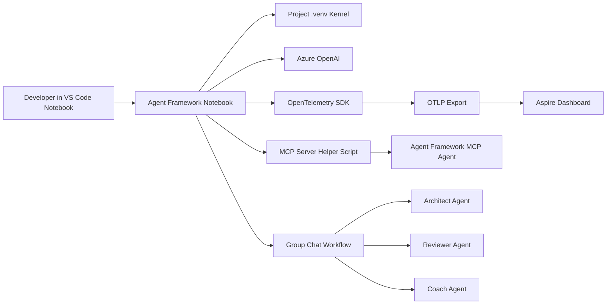
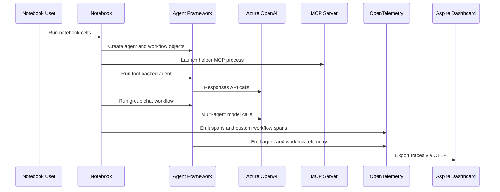

# Microsoft Agent Framework SDK + Aspire Observability PoC

A standalone companion README for the Windows notebook PoC in this repo.

This document covers the Agent Framework-first notebook experience in [zolab-agent-framework-sdk-win11.ipynb](./zolab-agent-framework-sdk-win11.ipynb). It does not replace the main repo README, which continues to describe the broader Foundry deployment and bot workspace.

## Executive Summary

This PoC demonstrates a practical, notebook-driven way to build and observe Microsoft Agent Framework workloads on Windows without using Microsoft Foundry as the runtime layer.

The notebook combines four ideas in one guided flow:

- Agent creation with Microsoft Agent Framework and Azure OpenAI
- MCP server exposure using the official `agent.as_mcp_server()` pattern
- A simple multi-agent workflow using Agent Framework orchestration builders
- Rich local observability using OpenTelemetry exported to the Aspire Dashboard

The value of the PoC is not just that each capability works in isolation. The main outcome is that an engineer can create a local, inspectable, end-to-end agent system where prompts, orchestration, tool activity, MCP boundaries, and workflow spans all show up in one local observability surface.

In practical terms, this PoC answers three questions:

1. What does an Agent Framework-first implementation look like when it is not hidden behind a larger app host?
2. How do MCP and multi-agent workflows fit into that implementation in Python?
3. How do you preserve detailed telemetry while keeping the demo simple enough to teach and debug?

## Description

This PoC is intentionally focused on a single teaching surface: one notebook that can be opened in VS Code, run cell by cell, and used to inspect the behavior of agents, tools, workflows, and observability in one place.

The notebook is designed around these constraints:

- Windows 11 and VS Code friendly
- `.venv`-based local setup
- Azure OpenAI for model execution
- Microsoft Agent Framework as the primary SDK
- Aspire Dashboard as the primary trace viewer
- No Foundry project endpoint in the notebook runtime path

That makes it a useful contrast to the rest of this repo, which includes Foundry-oriented infrastructure, bot runtime code, and deployment automation.

## What This PoC Demonstrates

- A local virtual-environment and kernel bootstrap flow for notebook-driven Agent Framework work
- Direct Azure OpenAI configuration using `AzureCliCredential`
- An Agent Framework agent with local tools
- An MCP example where an Agent Framework agent is exposed as a stdio MCP server
- A basic group-chat workflow using `GroupChatBuilder`
- OpenTelemetry instrumentation exported to Aspire Dashboard over OTLP
- Cleanup flows for the MCP subprocess, Aspire container, Aspire image, and Azure credential

## Primary Assets

- Notebook: [zolab-agent-framework-sdk-win11.ipynb](./zolab-agent-framework-sdk-win11.ipynb)
- Existing repo overview: [README.md](../README.md)
- Existing observability notes: [observability.md](../observability.md)
- Foundry deployment guide: [deployment/README.md](../deployment/README.md)
- Bot workspace guide: [bot-app/README.md](../bot-app/README.md)
- Bot runtime guide: [bot-app/runtime/README.md](../bot-app/runtime/README.md)
- Agent Framework migration notes: [bot-app/docs/agent-framework-migration-plan.md](../bot-app/docs/agent-framework-migration-plan.md)
- Refactor summary: [bot-app/docs/refactor-executive-summary.md](../bot-app/docs/refactor-executive-summary.md)

## Architecture

### Runtime View

## Notebook Walkthrough

The notebook is organized as a step-by-step PoC, not as a generic SDK sample dump.

| Section | Purpose |
|---|---|
| `0` | Create or reuse `.venv` and register a Jupyter kernel |
| `1` | Install Python dependencies for Agent Framework, MCP, OpenTelemetry, and workflows |
| `2` | Resolve Azure OpenAI configuration and authenticate with Azure CLI |
| `3` | Start the Aspire Dashboard container and surface the browser token/login URL |
| `3.1` | Enable OpenTelemetry and establish a notebook-friendly logging profile |
| `4` | Create a tool-backed Agent Framework agent |
| `4.1` | Run the basic agent |
| `5` | Generate and run an MCP server helper script |
| `6` | Build and run a simple multi-agent workflow |
| `7` | Stop the MCP process, remove the Aspire container/image, and close credentials |

## Why Aspire Matters Here

The Aspire Dashboard is the differentiator for this PoC.

Without it, the notebook would still prove that the code works. With it, the notebook proves how the code behaves.

That matters because the interesting part of Agent Framework is not only the final answer. It is the execution path:

- which spans were emitted
- which workflow step ran next
- which agent participated
- how long each step took
- whether model and MCP boundaries correlate cleanly in traces

For a local teaching PoC, Aspire is the fastest way to make those questions visible.

## Setup Summary

### Prerequisites

- Python 3.13+
- VS Code with Jupyter support
- Azure CLI logged in with access to the target Azure OpenAI resource
- Docker Desktop for Aspire Dashboard
- An Azure OpenAI endpoint and deployment name

### Notebook Install Set

The notebook installs these major packages:

- `agent-framework-core`
- `agent-framework-orchestrations`
- `azure-identity`
- `mcp`
- `anyio`
- `ipykernel`
- `opentelemetry-exporter-otlp-proto-grpc`

## Quick Start

1. Open [zolab-agent-framework-sdk-win11.ipynb](./zolab-agent-framework-sdk-win11.ipynb).
2. Run the virtual-environment and dependency cells first.
3. Switch the notebook to the registered `.venv` kernel.
4. Run the Azure OpenAI configuration cell.
5. Run the Aspire Dashboard startup cell and use the printed browser token or login URL.
6. Run the observability cell to initialize OTLP export.
7. Run the basic agent section.
8. Run the MCP demo.
9. Run the multi-agent workflow section.
10. Use the cleanup section when you are done.

## Observability Design Notes

This PoC chooses strong observability over minimal console output.

The intended telemetry model is:

- spans stay rich enough for Aspire exploration
- prompts and responses are visible in a controlled demo context
- the notebook remains understandable while still showing that real tracing is happening

This is deliberately different from a production posture. In production, you would likely reduce sensitive data capture, harden auth posture further, and control sampling more aggressively.

## Scope Boundaries

This notebook PoC is intentionally separate from the Foundry-focused parts of the repo.

### In Scope

- Notebook-based Agent Framework exploration
- Azure OpenAI-backed Agent Framework usage
- MCP server exposure from Agent Framework
- Local workflow orchestration demos
- Aspire-based tracing and troubleshooting

### Out of Scope

- Foundry project runtime inside this notebook
- Teams bot hosting as the notebook execution surface
- Production deployment patterns for the notebook itself
- Full MCP client-host integration beyond the server demonstration pattern

## Relationship To The Rest Of The Repo

This repo has three useful layers of material:

1. The main repo README and deployment docs describe the existing Foundry-centered environment and infrastructure.
2. The `bot-app/` subtree describes the Teams-based runtime and worker architecture.
3. This PoC README describes the standalone Agent Framework notebook path that is intentionally simpler and more inspectable.

That split is useful because it lets you compare two approaches:

- a larger system with deployment and bot runtime concerns
- a focused notebook that isolates Agent Framework, MCP, workflows, and tracing

## Known Tradeoffs

- The notebook is optimized for learning and inspection, not for minimal package count.
- The MCP demonstration is strongest on the server-exposure side; it is not trying to be a full reusable host product.
- The workflow section can still generate substantial transcript output because multi-agent conversations are naturally verbose.
- The notebook depends on local Docker availability if you want the full Aspire experience.

## Recommended Next Steps

- Add a small in-notebook MCP client validation step if you want a full request-response MCP proof in the same notebook
- Add a second workflow example, such as sequential or handoff orchestration, for comparison
- Add a lighter observability profile for users who want Aspire traces but almost no notebook console output
- Extract the MCP helper and workflow helpers into reusable repo scripts if this notebook becomes a longer-lived teaching asset

## Related References

- Microsoft Agent Framework repo: [https://github.com/microsoft/agent-framework](https://github.com/microsoft/agent-framework)
- Existing repo overview: [README.md](../README.md)
- Foundry deployment details: [deployment/README.md](../deployment/README.md)
- Existing observability notes: [observability.md](../observability.md)
- Bot runtime architecture: [bot-app/runtime/README.md](../bot-app/runtime/README.md)

## Bottom Line

This PoC is a clean, local, inspectable example of Microsoft Agent Framework used the way many engineers actually need it during exploration: one notebook, one Azure OpenAI-backed runtime, one MCP example, one workflow example, and one strong observability surface.

That makes it a useful companion to the broader Foundry and bot assets in this repo, not a replacement for them.
