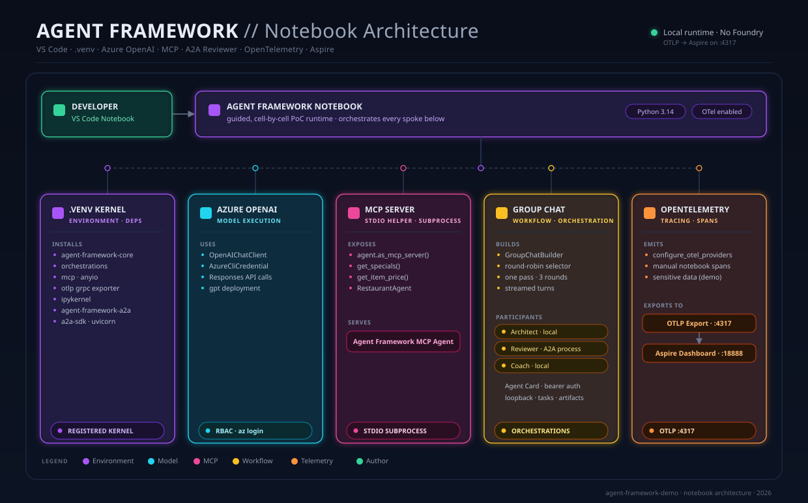
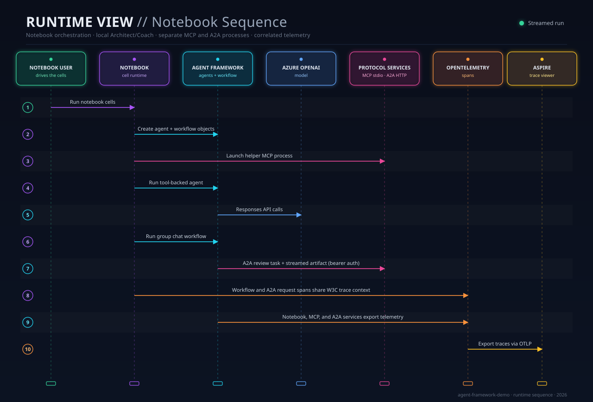
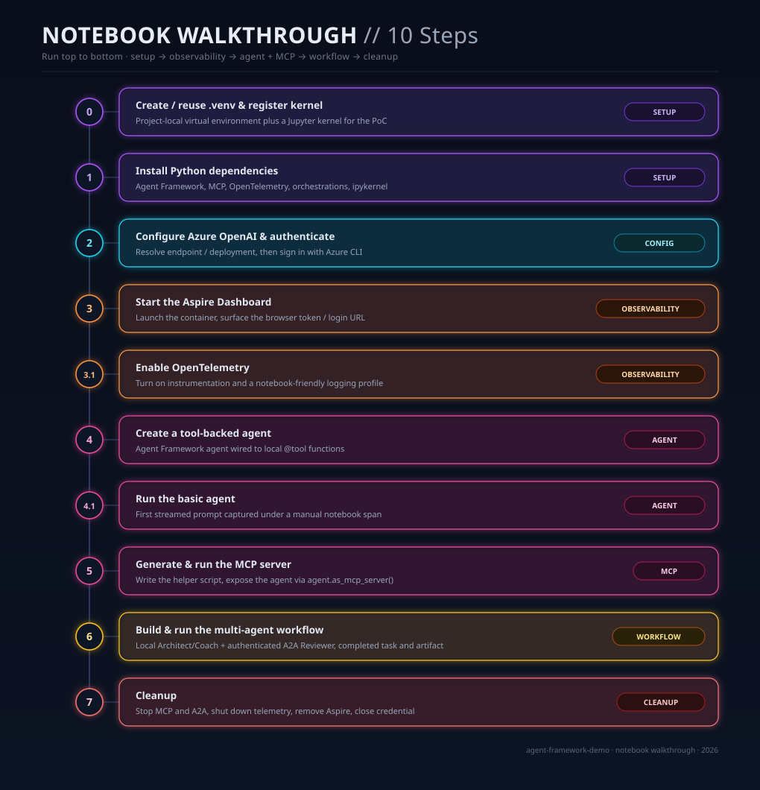

# Microsoft Agent Framework SDK + Aspire Observability PoC

A standalone companion README for the Windows notebook PoC in this repo.

This document covers the Agent Framework-first notebook experience in [zolab-agent-framework-sdk-win11.ipynb](./zolab-agent-framework-sdk-win11.ipynb). It does not replace the main repo README, which continues to describe the broader Foundry deployment and bot workspace.

## Executive Summary

This PoC demonstrates a practical, notebook-driven way to build and observe Microsoft Agent Framework workloads on Windows without using Microsoft Foundry as the runtime layer.

The notebook combines four ideas in one guided flow:

- Agent creation with Microsoft Agent Framework and Azure OpenAI
- MCP server exposure using the official `agent.as_mcp_server()` pattern
- A simple multi-agent workflow using Agent Framework orchestration builders
- Rich local observability using OpenTelemetry exported to the Aspire Dashboard

The value of the PoC is not just that each capability works in isolation. The main outcome is that an engineer can create a local, inspectable, end-to-end agent system where prompts, orchestration, tool activity, MCP boundaries, and workflow spans all show up in one local observability surface.

In practical terms, this PoC answers three questions:

1. What does an Agent Framework-first implementation look like when it is not hidden behind a larger app host?
2. How do MCP and multi-agent workflows fit into that implementation in Python?
3. How do you preserve detailed telemetry while keeping the demo simple enough to teach and debug?

## Description

This PoC is intentionally focused on a single teaching surface: one notebook that can be opened in VS Code, run cell by cell, and used to inspect the behavior of agents, tools, workflows, and observability in one place.

The notebook is designed around these constraints:

- Windows 11 and VS Code friendly
- `.venv`-based local setup
- Azure OpenAI for model execution
- Microsoft Agent Framework as the primary SDK
- Aspire Dashboard as the primary trace viewer
- No Foundry project endpoint in the notebook runtime path

That makes it a useful contrast to the rest of this repo, which includes Foundry-oriented infrastructure, bot runtime code, and deployment automation.

## What This PoC Demonstrates

- A local virtual-environment and kernel bootstrap flow for notebook-driven Agent Framework work
- Direct Azure OpenAI configuration using `AzureCliCredential`
- An Agent Framework agent with local tools
- An MCP example where an Agent Framework agent is exposed as a stdio MCP server
- A basic group-chat workflow using `GroupChatBuilder`
- OpenTelemetry instrumentation exported to Aspire Dashboard over OTLP
- Cleanup flows for the MCP subprocess, Aspire container, Aspire image, and Azure credential

## Primary Assets

- Notebook: [zolab-agent-framework-sdk-win11.ipynb](./zolab-agent-framework-sdk-win11.ipynb)
- Existing repo overview: [README.md](../README.md)
- Existing observability notes: [observability.md](../observability.md)
- Foundry deployment guide: [deployment/README.md](../deployment/README.md)
- Bot workspace guide: [bot-app/README.md](../bot-app/README.md)
- Bot runtime guide: [bot-app/runtime/README.md](../bot-app/runtime/README.md)
- Agent Framework migration notes: [bot-app/docs/agent-framework-migration-plan.md](../bot-app/docs/agent-framework-migration-plan.md)
- Refactor summary: [bot-app/docs/refactor-executive-summary.md](../bot-app/docs/refactor-executive-summary.md)

## Architecture



### Runtime View



## Notebook Walkthrough

The notebook is organized as a step-by-step PoC, not as a generic SDK sample dump.



## Why Aspire Matters Here

The Aspire Dashboard is the differentiator for this PoC.

Without it, the notebook would still prove that the code works. With it, the notebook proves how the code behaves.

That matters because the interesting part of Agent Framework is not only the final answer. It is the execution path:

- which spans were emitted
- which workflow step ran next
- which agent participated
- how long each step took
- whether model and MCP boundaries correlate cleanly in traces

For a local teaching PoC, Aspire is the fastest way to make those questions visible.

## Setup Summary

### Prerequisites

- Python 3.13+
- VS Code with Jupyter support
- Azure CLI logged in with access to the target Azure OpenAI resource
- Docker Desktop for Aspire Dashboard. The notebook startup cell attempts to launch Docker Desktop on Windows when the Docker CLI is installed but the Linux engine is not ready.
- An Azure OpenAI endpoint and deployment name

### Notebook Install Set

The notebook installs these major packages:

- `agent-framework-core`
- `agent-framework-orchestrations`
- `azure-identity`
- `mcp`
- `anyio`
- `ipykernel`
- `opentelemetry-exporter-otlp-proto-grpc`

## Quick Start

1. Open [zolab-agent-framework-sdk-win11.ipynb](./zolab-agent-framework-sdk-win11.ipynb).
2. Run the virtual-environment and dependency cells first.
3. Switch the notebook to the registered `.venv` kernel.
4. Run the Azure OpenAI configuration cell.
5. Run the Aspire Dashboard startup cell and use the printed browser token or login URL. If Docker Desktop is not already running, the cell waits for the Docker Linux engine and prints a clear fallback status instead of raising a Docker `CalledProcessError`.
6. Run the observability cell to initialize OTLP export.
7. Run the basic agent section.
8. Run the MCP demo.
9. Run the multi-agent workflow section.
10. Use the cleanup section when you are done.

## Observability Design Notes

This PoC chooses strong observability over minimal console output.

The intended telemetry model is:

- spans stay rich enough for Aspire exploration
- prompts and responses are visible in a controlled demo context
- the notebook remains understandable while still showing that real tracing is happening

This is deliberately different from a production posture. In production, you would likely reduce sensitive data capture, harden auth posture further, and control sampling more aggressively.

### Aspire Dashboard Startup Behavior

The Windows notebook now handles the common Docker Desktop cold-start case explicitly:

- If Docker CLI is missing, the notebook skips Aspire and continues with console exporters.
- If Docker CLI is present but the Docker Desktop Linux engine is unavailable, the notebook attempts to start Docker Desktop and waits for the engine.
- If ports `18888` or `4317` are already busy, the notebook chooses available local ports and prints the actual Aspire UI and OTLP endpoint.
- If container startup fails, the notebook prints Docker stderr and keeps the rest of the demo runnable with console exporters.

## Scope Boundaries

This notebook PoC is intentionally separate from the Foundry-focused parts of the repo.

### In Scope

- Notebook-based Agent Framework exploration
- Azure OpenAI-backed Agent Framework usage
- MCP server exposure from Agent Framework
- Local workflow orchestration demos
- Aspire-based tracing and troubleshooting

### Out of Scope

- Foundry project runtime inside this notebook
- Teams bot hosting as the notebook execution surface
- Production deployment patterns for the notebook itself
- Full MCP client-host integration beyond the server demonstration pattern

## Relationship To The Rest Of The Repo

This repo has three useful layers of material:

1. The main repo README and deployment docs describe the existing Foundry-centered environment and infrastructure.
2. The `bot-app/` subtree describes the Teams-based runtime and worker architecture.
3. This PoC README describes the standalone Agent Framework notebook path that is intentionally simpler and more inspectable.

That split is useful because it lets you compare two approaches:

- a larger system with deployment and bot runtime concerns
- a focused notebook that isolates Agent Framework, MCP, workflows, and tracing

## Known Tradeoffs

- The notebook is optimized for learning and inspection, not for minimal package count.
- The MCP demonstration is strongest on the server-exposure side; it is not trying to be a full reusable host product.
- The workflow section can still generate substantial transcript output because multi-agent conversations are naturally verbose.
- The notebook depends on local Docker availability if you want the full Aspire experience.

## Recommended Next Steps

- Add a small in-notebook MCP client validation step if you want a full request-response MCP proof in the same notebook
- Add a second workflow example, such as sequential or handoff orchestration, for comparison
- Add a lighter observability profile for users who want Aspire traces but almost no notebook console output
- Extract the MCP helper and workflow helpers into reusable repo scripts if this notebook becomes a longer-lived teaching asset

## Related References

- Microsoft Agent Framework repo: [https://github.com/microsoft/agent-framework](https://github.com/microsoft/agent-framework)
- Existing repo overview: [README.md](../README.md)
- Foundry deployment details: [deployment/README.md](../deployment/README.md)
- Existing observability notes: [observability.md](../observability.md)
- Bot runtime architecture: [bot-app/runtime/README.md](../bot-app/runtime/README.md)

## Bottom Line

This PoC is a clean, local, inspectable example of Microsoft Agent Framework used the way many engineers actually need it during exploration: one notebook, one Azure OpenAI-backed runtime, one MCP example, one workflow example, and one strong observability surface.

That makes it a useful companion to the broader Foundry and bot assets in this repo, not a replacement for them.

## Appendix: Observability Stack by Python Import / Library

This appendix aligns the broader Microsoft agent observability stack to the Python imports and packages that commonly back each layer. Some layers are Python SDK imports used directly in notebooks or applications; others are Azure, Microsoft Sentinel, Microsoft Defender XDR, or Microsoft Entra service surfaces that are configured through portals, REST APIs, Microsoft Graph, ARM, connectors, or Log Analytics.

| Observability / security layer | Python import / package | What it does in a notebook or app | Notes |
| --- | --- | --- | --- |
| Microsoft Foundry | `from azure.ai.projects import AIProjectClient` | Creates the Foundry project client and retrieves project telemetry metadata. | Main SDK entry point for a Foundry project. |
| Microsoft Foundry project agents | `from azure.ai.projects.models import PromptAgentDefinition, MCPTool` | Defines project-backed agents and attaches MCP tools such as Microsoft Learn or Sentinel MCP. | `PromptAgentDefinition` describes the agent; `MCPTool` describes remote MCP tools. |
| Foundry agent tracing | `from azure.ai.projects.telemetry import AIProjectInstrumentor` | Enables client-side GenAI tracing for Foundry / Azure AI Projects operations. | Makes Foundry agent activity emit OpenTelemetry GenAI spans. |
| Foundry Responses API path | `project_client.get_openai_client()` | Gets the OpenAI-compatible client used for `conversations.create()` and `responses.create(...)`. | The `agent_reference` payload ties Responses API runs back to the Foundry project agent. |
| Azure authentication | `from azure.identity import DefaultAzureCredential` | Authenticates to Foundry, Azure Monitor, and Log Analytics APIs. | In the Agent Framework-only notebook, the equivalent explicit auth choice is `AzureCliCredential`. |
| OpenTelemetry trace model | `from opentelemetry import trace` | Creates tracers and manual spans. | Core trace/span API. |
| OpenTelemetry span metadata | `from opentelemetry.trace import SpanKind, Status, StatusCode` | Marks spans as client spans and records success/error state. | Used for operation kind and failure details. |
| OpenTelemetry baggage/context | `from opentelemetry import baggage, context as otel_context` | Adds safe correlation metadata such as run ID, agent name, model, project, and session ID. | Baggage should not contain secrets, tokens, or sensitive prompt data. |
| HTTP dependency instrumentation | `from opentelemetry.instrumentation.httpx import HTTPXClientInstrumentor` | Captures HTTPX dependency telemetry from SDK/network calls. | Helps Application Insights show outbound dependencies. |
| Manual dependency spans | `tracer.start_as_current_span("POST /openai/v1/responses", kind=SpanKind.CLIENT)` | Creates explicit client spans around `responses.create(...)`. | Makes notebook-side Responses API dependency calls visible in `AppDependencies`. |
| Azure Monitor exporter | `from azure.monitor.opentelemetry import configure_azure_monitor` | Exports OpenTelemetry traces to Azure Monitor / Application Insights. | Main bridge from OpenTelemetry to Azure Monitor. |
| Azure Monitor resource metadata | `from agent_framework.observability import create_resource` | Supplies resource attributes for Azure Monitor export. | Useful for stamping service/resource identity onto telemetry. |
| Application Insights | `configure_azure_monitor(connection_string=...)` | Receives exported OpenTelemetry telemetry. | There is no separate Application Insights import in the notebook; it is the destination configured through Azure Monitor OpenTelemetry. |
| `AppDependencies` | Azure Monitor ingestion from OpenTelemetry spans | Stores dependency/span-like operation records. | Populated by Azure Monitor from exported telemetry, not written directly by Python. |
| `AppGenAIContent` | `AIProjectInstrumentor` plus content-recording environment variables | Stores captured GenAI content such as inputs, outputs, system instructions, tool args, and tool results. | Microsoft-managed Azure Monitor table; Python enables content capture, Azure Monitor materializes the table. |
| GenAI content capture | `OTEL_INSTRUMENTATION_GENAI_CAPTURE_MESSAGE_CONTENT=true` and `AZURE_TRACING_GEN_AI_CONTENT_RECORDING_ENABLED=true` | Enables prompt/output/tool content capture for demo/debug scenarios. | Requires strong privacy controls in production. |
| Log Analytics query path | `urllib.request`, `urllib.error`, `json`, and `DefaultAzureCredential` | Calls `https://api.loganalytics.io/v1/workspaces/{workspace_id}/query`. | The Foundry notebook uses direct REST calls rather than `azure-monitor-query`. |
| Optional Log Analytics SDK | `from azure.monitor.query import LogsQueryClient` | SDK-based alternative for querying Log Analytics. | Cleaner for production code, but not required by the current notebook. |
| Microsoft Sentinel MCP | `from azure.ai.projects.models import MCPTool` | Defines the Sentinel MCP tool using `project_connection_id`. | Sentinel access is through Foundry project connection / OAuth passthrough, not a Sentinel Python SDK. |
| Sentinel workspace lookup | `subprocess` calling `az rest` and `az monitor log-analytics workspace show` | Resolves project connections and workspace identifiers. | CLI-driven discovery in the notebook. |
| Microsoft Sentinel SIEM | No direct Python import in this notebook | Consumes data through connectors, Log Analytics, and Defender portal experiences. | For management automation, use REST/ARM or `azure-mgmt-securityinsight`; for hunting, use Log Analytics. |
| Microsoft Defender XDR | No direct Python import in this notebook | Security operations plane for incidents, alerts, advanced hunting, and Sentinel integration. | Typically configured service-to-service through the Defender/Sentinel connector. For API work, use Microsoft Graph Security APIs. |
| Microsoft Entra Agent ID | No direct Python import in this notebook | Identity/governance concept for non-human agent identities. | For production automation, use Microsoft Graph plus `azure.identity`; the notebook currently uses Azure developer credentials. |
| Conditional Access | No direct Python import in this notebook | Entra policy plane for users, workload identities, and agent-related conditions. | Programmatic policy management is through Microsoft Graph `conditionalAccessPolicy`, not an Azure Monitor library. |

The most common import map for a Microsoft Foundry observability notebook looks like this:

```python
from agent_framework.observability import create_resource

from azure.ai.projects import AIProjectClient
from azure.ai.projects.models import MCPTool, PromptAgentDefinition
from azure.ai.projects.telemetry import AIProjectInstrumentor
from azure.core.settings import settings
from azure.identity import DefaultAzureCredential
from azure.monitor.opentelemetry import configure_azure_monitor

from opentelemetry import baggage, context as otel_context, trace
from opentelemetry.instrumentation.httpx import HTTPXClientInstrumentor
from opentelemetry.trace import SpanKind, Status, StatusCode
```

Shortest practical alignment:

- **Foundry**: `azure-ai-projects`
- **OpenTelemetry traces/spans**: `opentelemetry-api`, `opentelemetry-sdk`
- **Azure Monitor / Application Insights export**: `azure-monitor-opentelemetry`
- **Azure SDK trace bridge**: `azure-core-tracing-opentelemetry`
- **HTTP dependency spans**: `opentelemetry-instrumentation-httpx`
- **Identity**: `azure-identity`
- **Log Analytics queries**: REST with `urllib` + `DefaultAzureCredential`, or optional `azure-monitor-query`
- **Sentinel / XDR / Conditional Access / Entra Agent ID**: mostly service/API planes, commonly Microsoft Graph, ARM/REST, Sentinel connectors, and Log Analytics rather than notebook-local imports
