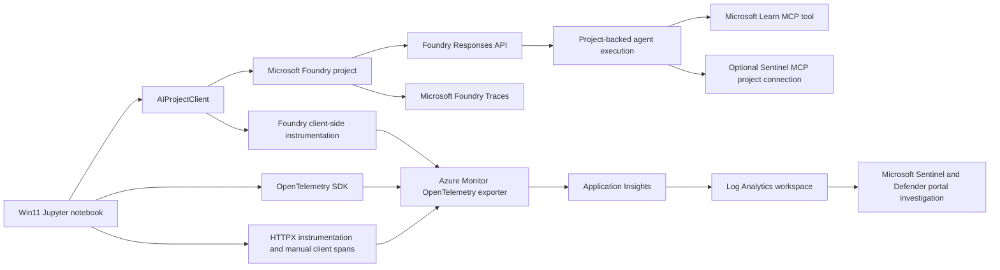

# Customer Demo Talk Track: Observability for Microsoft Foundry Agents

Duration: 40 minutes
Primary asset: `zolab-ai-agent-demo-win11.ipynb`
Scope: Microsoft Foundry, Azure Monitor, OpenTelemetry, Application Insights, Log Analytics, Microsoft Sentinel, Microsoft Defender XDR, Microsoft Entra Agent ID, and Conditional Access.
Out of scope: Teams bot infrastructure, worker deployment, and unrelated application modernization details.

## Demo Objective

By the end of this demo, the customer should understand how a pro-code agent application becomes observable when it is instrumented with OpenTelemetry and exported into Azure Monitor Application Insights while also surfacing agent-centric traces in Microsoft Foundry.

The simple message is:

> Microsoft Foundry shows the agent execution view. OpenTelemetry describes the execution as spans. Azure Monitor exports and stores the telemetry in Application Insights and Log Analytics. Microsoft Sentinel and Defender XDR turn related identity, connector, and agent activity into a security operations story.

## Audience Takeaways

- Agent observability is more than latency and failures. It needs to show execution path, model calls, tool calls, approvals, input/output handling, errors, and downstream dependencies.
- OpenTelemetry provides the common instrumentation model: traces, spans, span attributes, span events, resources, and propagation context.
- Azure Monitor Application Insights is the operational telemetry destination for the notebook. Because the Application Insights resource is workspace-based, the same data is queryable in Log Analytics.
- Microsoft Foundry Traces provides the agent-native view when the agent runs through the Foundry Responses API with an `agent_reference` payload.
- Security teams should treat AI agent telemetry as identity and activity evidence, then connect it to Microsoft Sentinel, Microsoft Defender XDR, Microsoft Entra Agent ID, and Conditional Access policy decisions.

## Demo Setup Checklist

- Open [zolab-ai-agent-demo-win11.ipynb](zolab-ai-agent-demo-win11.ipynb).
- Confirm the notebook kernel is `AI Agent Demo (.venv)`.
- Confirm a recent `build_info-<suffix>.json` exists in the repo root.
- Confirm the Microsoft Foundry project has Application Insights connected.
- Confirm the signed-in identity can read the connected Application Insights / Log Analytics workspace.
- Optional for the Sentinel segment: confirm the Microsoft Sentinel MCP project connection is configured and the signed-in identity has the required Sentinel / Log Analytics read access.
- Have browser tabs ready for:
  - Microsoft Foundry project Traces view
  - Application Insights Transaction Search / Failures / Application Map
  - Log Analytics Logs
  - Microsoft Sentinel in the Microsoft Defender portal
  - Microsoft Entra Conditional Access and Agent ID overview, if available in the customer tenant

## 40 Minute Agenda

| Time | Segment | Outcome |
| --- | --- | --- |
| 0:00-3:00 | Opening and framing | Establish why agents need observability beyond standard application monitoring. |
| 3:00-7:00 | Architecture relationship | Explain Microsoft Foundry, OpenTelemetry, Azure Monitor, Application Insights, and Log Analytics. |
| 7:00-13:00 | Notebook telemetry setup | Walk through Section 3.1 and show how tracing is enabled. |
| 13:00-21:00 | Spans and agent behavior | Explain how spans capture agent execution, behavior, inputs, outputs, and dependencies. |
| 21:00-28:00 | Live notebook run | Run or review Sections 4, 5, 5.1, and generated telemetry. |
| 28:00-33:00 | Validation surfaces | Show Foundry Traces, Application Insights, and Log Analytics KQL. |
| 33:00-38:00 | Security operations extension | Cover XDR, the Sentinel Agent Observability Data Connector / Agent 365, Non-Human Identities, and Conditional Access. |
| 38:00-40:00 | Wrap and customer questions | Close with operating model, risks, and next steps. |

## Simple Architecture Narrative



Speaker note:

> The notebook is the pro-code application. Microsoft Foundry is the agent platform. OpenTelemetry is the instrumentation language. Azure Monitor is the export path. Application Insights is the application observability surface. Log Analytics is the KQL investigation surface. Foundry Traces is the agent execution surface. Security operations can then consume related activity in Microsoft Sentinel and Microsoft Defender XDR.

## 0:00-3:00 - Opening

Start with the customer problem.

Say:

> Today I want to show agent observability from the application developer view and from the security operations view. Traditional application monitoring asks: did the request fail, how long did it take, and what dependency was slow? Agent monitoring needs those same answers, but it also needs more context: which agent ran, which model was used, which tools were called, what approvals happened, what input drove the run, what output came back, and where the run touched external systems.

Then set expectations.

Say:

> This demo is focused on the Windows 11 Jupyter notebook and its observability flow. We are not going to walk through Teams bot infrastructure or unrelated deployment details. We are going to stay tightly focused on Microsoft Foundry, OpenTelemetry, Azure Monitor, Application Insights, and the security operating model around Sentinel, XDR, Non-Human Identities, and Conditional Access.

What to show:

- The notebook title and prerequisites.
- The notebook sections, especially 3.1, 4, 5, 5.1, and 6.

Transition:

> Before I run anything, let me show the mental model. Once this clicks, the notebook cells make a lot more sense.

## 3:00-7:00 - Architecture Relationship

Say:

> There are four observability layers in this demo.

Use this short explanation:

- Microsoft Foundry is where the agent is defined and executed through a project-backed Responses API call.
- OpenTelemetry is the standard instrumentation model that turns the run into traces and spans.
- Azure Monitor is the Microsoft telemetry pipeline that receives the OpenTelemetry data.
- Application Insights stores the application telemetry and makes it visible through transaction search, dependencies, failures, Application Map, and workspace-backed Log Analytics queries.

Say:

> Foundry and Azure Monitor are not competing views. Foundry gives us the agent-native view. Application Insights gives us the application and dependency view. Log Analytics lets us query the telemetry at scale and join it with operational or security data.

Important relationship to emphasize:

| Component | Role in the demo | Customer-friendly explanation |
| --- | --- | --- |
| Microsoft Foundry | Agent project, project agent, Responses API, Foundry Traces | The agent execution control plane and agent-centric trace view. |
| OpenTelemetry | Spans, attributes, events, resources, context propagation | The common vocabulary that describes what happened during execution. |
| Azure Monitor | Exporter and Azure observability backend | The pipeline that receives telemetry and sends it to Application Insights. |
| Application Insights | Distributed tracing and dependency tracking | The app operations view: dependencies, latency, failures, and correlation. |
| Log Analytics | KQL over workspace-backed telemetry | The investigation and reporting view. |
| Microsoft Sentinel / Defender XDR | Security operations and correlation | The security view for incidents, hunting, identity risk, and agent activity. |

Transition:

> Now let us look at how the notebook turns this on. The important part is that observability is not bolted on after the agent runs. It is part of how the agent is invoked.

## 7:00-13:00 - Notebook Telemetry Setup

Open Section 3.1 in [zolab-ai-agent-demo-win11.ipynb](zolab-ai-agent-demo-win11.ipynb).

Say:

> Section 3.1 is the observability switchboard. It configures trace settings, retrieves the Application Insights connection string from the Foundry project, initializes Azure Monitor, enables Foundry client-side tracing, instruments HTTPX, and creates a tracer the notebook can use for custom spans.

Point out these setup actions:

1. Trace settings are declared before instrumentation.
2. The notebook sets an OpenTelemetry service name and service version.
3. The notebook sets resource attributes such as service namespace, service instance ID, environment, and Foundry project name.
4. The notebook calls `project_client.telemetry.get_application_insights_connection_string()` so it does not hardcode the telemetry destination.
5. The notebook calls `configure_azure_monitor(...)` to send traces into Application Insights.
6. The notebook calls `AIProjectInstrumentor().instrument()` so Foundry / Azure AI Projects SDK operations emit GenAI spans.
7. The notebook calls `HTTPXClientInstrumentor().instrument()` so HTTP client dependencies are captured.
8. The notebook creates `tracer = trace.get_tracer("foundry_agent_framework_notebook")` for custom notebook spans.
9. When GenAI content recording is enabled, Azure Monitor materializes captured prompt, response, system instruction, and tool content into the workspace-level `AppGenAIContent` table.

Suggested speaker script:

> The first important move is that the notebook retrieves the Application Insights connection string from the Foundry project. That gives us a project-connected telemetry path. The second important move is that Azure Monitor is configured as the OpenTelemetry exporter. That means spans created by the notebook, by Azure SDK instrumentation, by the Foundry client-side instrumentation, and by HTTPX instrumentation have a path into Application Insights. The third important move is context propagation. The notebook enables trace context propagation so the client-side spans can correlate with downstream service work.

Call out trace context and baggage:

> Trace context is how distributed tracing keeps parent and child operations connected across network calls. In Python, the Foundry tracing guidance supports W3C trace context propagation for OpenAI clients obtained from `get_openai_client()`. The notebook also uses baggage for safe correlation metadata like run ID, agent name, model name, project name, and telemetry session ID. Baggage should never contain secrets, raw tokens, or sensitive personal data.

Content recording note:

> For this demo, content recording can be enabled so we can prove that prompt and output capture is possible. In production, this is a governance decision. Prompt text, tool arguments, and model outputs can contain sensitive data. The recommended operating model is to keep content recording off by default and turn it on only for approved, time-bound debugging or controlled evaluation.

`AppGenAIContent` callout:

> A useful table to call out here is `AppGenAIContent`. The notebook does not create that table and does not write to it directly. It is a Microsoft-managed Azure Monitor Logs table in the Log Analytics workspace behind Application Insights. When the Azure AI Projects / Foundry GenAI instrumentation emits OpenTelemetry content records and the Azure Monitor exporter sends them to the project's Application Insights connection string, Azure Monitor stores the captured GenAI payload fields in `AppGenAIContent`.

That is where you look for model input messages, output messages, system instructions, tool definitions, tool call arguments, tool call results, agent name, agent ID, model name, `TraceId`, and `SpanId`. It is extremely useful for demos and debugging, but it is also the table that deserves the strongest privacy conversation.

Transition:

> At this point the notebook has not just turned on monitoring. It has created the conditions for meaningful agent observability: every run can have a trace, every major step can have a span, and every span can carry useful attributes.

## 13:00-21:00 - Spans and Agent Behavior

Explain spans in plain language.

Say:

> A trace is the whole story of one operation. A span is one chapter in that story. A span has a name, start time, end time, parent relationship, attributes, events, status, and sometimes exceptions. For agents, spans are valuable because they let us separate the orchestration logic from the model call, the tool call, the approval, the persistence step, and the outbound HTTP dependency.

Use this table:

| Span or telemetry item | Where it appears in the notebook | What it tells us |
| --- | --- | --- |
| `create_agent <name>` | Section 4 | Agent name, model, tools attached, agent ID, version, and creation success or failure. |
| `invoke_agent <name>` | Section 5 | Agent invocation, prompt, model, interaction name, conversation ID, completion preview, status, and approvals. |
| `POST /openai/v1/responses` | Sections 5 and 5.1 | Concrete client-side dependency row for the Foundry Responses API call. |
| `persist_story` | Section 5 | Persistence of the generated story and Microsoft Learn result into `stories.json`. |
| `sentinel-agent-query` | Section 5.1 | Sentinel-specific agent run, target UPN, workspace, subscription, response status, and tool error details. |
| `mcp.approval.auto_approved` event | Sections 5 and 5.1 | Tool approval behavior and approval round count. |
| Exception and error attributes | Sections 4, 5, and 5.1 | Failure type, status, error details, and response context. |

Explain behavior capture:

> Agent behavior is not just the final answer. Behavior is the sequence: create conversation, send prompt, call the Responses API, request tool approval, approve tool use, receive tool output, produce response, persist result, and validate telemetry. The notebook instruments that sequence explicitly.

Explain input and output capture:

> Inputs and outputs can be captured in two ways. First, automatic GenAI tracing can capture message content when content recording is enabled, and Azure Monitor can place that captured content into `AppGenAIContent`. Second, the notebook sets custom attributes like `app.prompt` and a bounded `app.completion` preview on the invocation span. That gives us a controlled way to inspect what drove the run and what came back. The governance point is important: capturing content is powerful, but it must be deliberate.

Explain tool calls and approvals:

> Tool calls are where agents start to behave like distributed systems. The Microsoft Learn MCP path and the Sentinel MCP path are external capabilities. The notebook watches approval requests, records the approval rounds, records output types, and records tool errors. That matters because tool behavior is often where agent risk appears: excessive approvals, unexpected tools, missing workspace IDs, failed OAuth, or a user identity that lacks PIM activation.

Explain dependency spans:

> Foundry traces alone are not enough for an Application Insights Service Map. The notebook emits explicit client spans around `responses.create(...)` so Application Insights has concrete dependency rows for the `POST /openai/v1/responses` call. That gives operations teams a visible edge from the notebook process to the Foundry Responses API path.

Transition:

> Now we can run the notebook path and then look at the telemetry surfaces.

## 21:00-28:00 - Live Notebook Run

Recommended live sequence:

1. Confirm Section 3 has configured credentials and the project client.
2. Run or review Section 3.1 to show telemetry is enabled.
3. Run or review Section 3.2 to show the Microsoft Learn MCP tool spec.
4. Run or review Section 3.3 only if the Sentinel project connection exists.
5. Run Section 4 to create or version the project-backed agent.
6. Run Section 5 to invoke the main agent and generate the Microsoft Learn grounded response.
7. Run Section 5.1 only when Sentinel access is ready.
8. Run Section 6 to validate telemetry in Log Analytics.

Talk track while running Section 4:

> This cell creates a project-backed agent version in Foundry. Notice that we set span attributes for the GenAI operation name, provider, requested model, agent name, instructions, runtime, tool count, and tool labels. If this fails, the exception is recorded on the span. If it succeeds, the span gets the agent ID and agent version.

Talk track while running Section 5:

> Here we run two interactions. The first produces the fictional story. The second asks the same project-backed agent to use Microsoft Learn through MCP for factual guidance. The important observability detail is that both interactions run through `responses.create(...)` with `extra_body` containing `agent_reference`. That agent reference is what lets Foundry correlate the trace to the project agent.

Talk track while running Section 5.1:

> The Sentinel path is separate by design. It uses the Foundry project connection because Sentinel MCP requires identity passthrough. This is a useful demo of security-aware observability: the telemetry records target identity, workspace, subscription, response status, and tool errors. If PIM is not active or RBAC is missing, the notebook captures enough context to troubleshoot without pretending the agent succeeded.

Suggested pause:

> The agent response is interesting, but the answer is not the whole demo. The real demo is that we can now explain how the answer happened.

## 28:00-33:00 - Validation Surfaces

### Microsoft Foundry Traces

Show the Foundry project Traces view.

Say:

> Foundry Traces is the agent-native view. This is where an AI engineer or app developer can look at the agent run in the context of the Foundry project. The key is that the call included the agent reference, so the run is not just a generic model call. It is associated with the project-backed agent.

What to point out:

- Agent run or Responses API activity.
- Model call details.
- Tool activity, where available.
- Timing and status.
- Any captured content, if enabled for the demo.

### Application Insights

Show Application Insights transaction search, failures, dependencies, or Application Map.

Say:

> Application Insights is where the same run becomes an operational trace. I can see dependency calls, latency, success and failure status, and correlation through operation IDs. This is the view an operations team expects from a distributed application.

What to point out:

- Dependency rows for `POST /openai/v1/responses`.
- Spans named `create_agent`, `invoke_agent`, `persist_story`, and `sentinel-agent-query`.
- Duration and success/failure.
- Operation ID correlation.
- Cloud role name / service name metadata from OpenTelemetry resource attributes.
- Captured GenAI content in `AppGenAIContent`, when content recording is enabled.

### Log Analytics

Show Section 6 and KQL results.

Say:

> Log Analytics is where the trace becomes queryable evidence. We can filter by run ID, agent name, model, interaction, operation ID, success flag, duration, and custom attributes.

Use or adapt this KQL during the demo:

```kusto
AppDependencies
| where TimeGenerated > ago(6h)
| where Name startswith "create_agent "
    or Name startswith "invoke_agent "
    or Name == "POST /openai/v1/responses"
    or Name == "sentinel-agent-query"
| extend
    demo_run_id = tostring(Properties["demo.run_id"]),
    interaction = tostring(Properties["app.interaction"]),
    agent_name = tostring(Properties["gen_ai.agent.name"]),
    model = tostring(Properties["gen_ai.request.model"]),
    prompt = tostring(Properties["app.prompt"]),
    completion = tostring(Properties["app.completion"])
| project TimeGenerated, Name, demo_run_id, interaction, agent_name, model, Success, DurationMs, OperationId, prompt, completion
| order by TimeGenerated desc
```

Then show where content-recorded GenAI payloads land:

```kusto
AppGenAIContent
| where TimeGenerated > ago(6h)
| project
    TimeGenerated,
    TraceId,
    SpanId,
    AgentName,
    AgentId,
    ModelName,
    SystemInstructions,
    InputMessages,
    OutputMessages,
    ToolCallArguments,
    ToolCallResult
| order by TimeGenerated desc
```

Say:

> `AppDependencies` tells us what operation happened, how long it took, whether it succeeded, and how it correlates. `AppGenAIContent` tells us what GenAI content was captured for the associated trace and span. The bridge between them is the trace and span identity: `TraceId` and `SpanId` on the GenAI content side, and `OperationId`, `Id`, and parent IDs on the Application Insights operation side.

Then show a trend query:

```kusto
AppDependencies
| where TimeGenerated > ago(6h)
| where Name startswith "invoke_agent " or Name == "POST /openai/v1/responses"
| summarize
    Calls = count(),
    Failures = countif(Success == false),
    AvgDurationMs = avg(DurationMs),
    P95DurationMs = percentile(DurationMs, 95)
    by bin(TimeGenerated, 15m), tostring(Properties["gen_ai.agent.name"]), tostring(Properties["app.interaction"])
| order by TimeGenerated desc
```

Transition:

> So far we have treated observability as an application reliability capability. The same telemetry also becomes part of the AI security operating model.

## 33:00-38:00 - XDR, Sentinel Agent Observability, Non-Human Identities, and Conditional Access

### Microsoft Sentinel, Defender XDR, and Agent Observability

Say:

> Microsoft Sentinel and Microsoft Defender XDR are converging around unified security operations in the Defender portal. Defender XDR brings endpoint, identity, email, app, and cloud signals together into correlated incidents. Sentinel brings SIEM, data connectors, hunting, automation, multicloud, third-party sources, and longer-term investigation patterns. For AI agent scenarios, that matters because agent behavior is both application activity and security-relevant activity.

Key points:

- Microsoft Defender XDR correlates alerts and behaviors across endpoints, identities, email, and applications.
- Microsoft Sentinel can integrate with Defender XDR so incidents, alerts, entities, and advanced hunting events can be investigated from a unified SOC experience.
- In Sentinel, data connectors are the ingestion mechanism for Microsoft, partner, third-party, custom, and agent-based sources.
- The current Sentinel data connector catalog includes `Agent 365`, described as bringing richer insights into AI agent activity by bringing AI agent telemetry into Sentinel.

Important wording:

> If someone refers to the Sentinel Agent Observability Data Connector, the current Sentinel connector catalog language to anchor on is the `Agent 365` data connector. The customer conversation is: how do we get AI agent telemetry into the SOC, then correlate it with identity, endpoint, cloud, and application signals?

How to connect this to the notebook:

> The notebook is not itself installing that connector. The notebook proves the telemetry shape: agent name, run ID, model, prompt policy, tool labels, approvals, target identity, workspace, errors, and dependency calls. In production, the Sentinel/Defender path is where those signals become SOC-operational: detection, hunting, incident enrichment, and response.

Potential hunting hypotheses:

- Agent invoked a tool that is not expected for its business function.
- Agent produced a high number of approval requests.
- Agent queried a Sentinel workspace outside its expected scope.
- Agent identity accessed resources from an unexpected execution environment.
- Agent run contained sensitive prompt or output content when content recording was not approved.
- Agent failures correlate with Conditional Access, PIM, OAuth consent, or RBAC changes.

### Non-Human Identities and Microsoft Entra Agent ID

Say:

> Agents are Non-Human Identities. They need identity lifecycle, authentication, authorization, governance, audit, and risk controls. Microsoft Entra Agent ID is the current Microsoft identity framing for this: it extends Entra security and governance concepts to AI agents.

Key points:

- Agent identities are purpose-built identity constructs for AI agents.
- Entra Agent ID supports patterns such as OAuth 2.0, MCP, and agent-to-agent communication.
- Agent identities need lifecycle management, access governance, audit logs, and risk detection.
- For production workloads, replace developer-only credential patterns with managed identities, workload identity federation, or governed agent identities where appropriate.
- Treat agent telemetry as identity evidence: who or what acted, under which identity, against which resource, under what conditions, and with what result.

Connect to the notebook:

> In this notebook, local authentication comes through `DefaultAzureCredential`, and the Sentinel MCP path uses the signed-in user identity for delegated access. That is useful for a demo. For production, the key design question is what identity the agent should have, what that identity is allowed to do, and how every action is audited.

### Conditional Access for Agents and Workload Identities

Say:

> Conditional Access is the policy engine for access decisions. For users, it combines signals like user, location, device, risk, and client app. For agents and workload identities, the policy model is evolving to account for Non-Human Identity access patterns and agent execution environments.

Key points to explain:

- Conditional Access policies should be planned carefully and tested in report-only mode before enforcement.
- Service principals are not controlled by user-scoped Conditional Access policies. Use Conditional Access for workload identities when the target is service principals.
- Microsoft Entra guidance now includes agent-specific concepts such as agent risk and agent execution environments in Conditional Access conditions.
- Agent execution environment matters because some agents run on endpoints and some run directly in cloud infrastructure. Endpoint-dependent controls should not be blindly applied to cloud-only agents.
- PIM and least privilege remain important for administrative access, Sentinel workspace access, and troubleshooting.
- Emergency access accounts and exclusions must be governed carefully to avoid lockout.

Customer-facing security model:

| Question | Observability answer | Security control answer |
| --- | --- | --- |
| Which agent ran? | `gen_ai.agent.name`, agent ID, version, run ID | Entra Agent ID / governed agent identity |
| What did it access? | Tool labels, target workspace, dependency URL, resource attributes | RBAC, least privilege, scoped project connections |
| Why was access allowed? | Conversation ID, signed-in identity, span attributes, response status | Conditional Access, workload identity policy, PIM, consent governance |
| What did it do? | Prompt, output preview, tool approvals, errors, span events | Sentinel hunting, Defender XDR incident correlation, audit logs |
| Was the behavior normal? | Trends, duration, failures, approval count, tool use pattern | UEBA, agent risk, custom detections, analytics rules |

Close this section:

> The main security point is that agent observability should not live only with developers. The same run metadata that helps an engineer debug a model call also helps a SOC analyst answer whether an agent acted within policy.

## 38:00-40:00 - Close

Say:

> The takeaway is that Microsoft Foundry and Azure Monitor solve different but complementary parts of the agent observability problem. Foundry shows the agent execution. OpenTelemetry gives us the trace and span model. Azure Monitor Application Insights gives us operational telemetry and dependency correlation. Log Analytics gives us KQL. Microsoft Sentinel and Defender XDR give us the security operations path. Microsoft Entra Agent ID and Conditional Access give us the identity and policy layer for Non-Human Identities.

Final customer message:

> For a production AI agent, the goal is not just to get an answer from the model. The goal is to prove how the answer happened, which identity acted, which tools were used, what data crossed boundaries, what policy applied, and how security operations can detect and respond when behavior changes.

Leave the customer with three next steps:

1. Standardize agent trace attributes across applications: agent name, agent ID, model, run ID, interaction type, tool labels, and business scenario.
2. Define a content recording policy: what can be captured, when it can be captured, who can view it, and how long it is retained.
3. Connect agent observability to security operations: Sentinel/Defender ingestion, Entra Agent ID, workload identity policy, PIM, and Conditional Access reporting.

## Presenter Notes and Backup Explanations

### What Is a Span?

A span is a timed operation inside a trace. It can represent a model call, a tool call, a persistence operation, a dependency call, or a custom application step. Spans can include attributes, events, errors, and status. When spans share the same trace context, they become an end-to-end story.

### What Makes a GenAI Span Useful?

Useful GenAI spans include:

- Operation name, such as `create_agent` or `responses.create`.
- Agent name, ID, and version.
- Model deployment.
- Prompt or prompt reference, depending on content policy.
- Output or output preview, depending on content policy.
- Tool labels and tool approval events.
- Conversation ID and response ID.
- Error type and failure status.
- Run ID and session ID for correlation.

### Why Emit Manual Spans If the SDK Instruments Calls?

Automatic instrumentation captures SDK and HTTP activity. Manual spans capture the notebook's business logic and orchestration decisions. For agents, that distinction matters. The SDK can show that a response was created, but the notebook can show whether it was the story interaction, the Microsoft Learn interaction, the Sentinel interaction, or the persistence step.

### Why Use Baggage?

Baggage lets safe correlation metadata travel with the trace context. In this demo, baggage is appropriate for values like run ID, project name, agent name, model name, and telemetry session ID. Baggage is not appropriate for secrets, tokens, full prompts, sensitive outputs, or private customer data.

### What About Sampling?

For a live demo, 100 percent sampling is useful because every run should be visible. For production, sampling should be aligned to operational needs, cost controls, and incident response requirements. Metrics are generally not sampled the same way traces are, so production monitoring should not rely only on sampled traces for critical alerting.

### What About Privacy?

Content recording can capture user messages, model outputs, system instructions, tool definitions, tool call arguments, and tool results. In Azure Monitor, that content can appear in `AppGenAIContent`. That is powerful for debugging and evaluation, but risky if enabled broadly. The policy should define allowed environments, retention, access controls, redaction expectations, and approval process.

## Optional KQL Appendix

### Latest Agent Runs

```kusto
AppDependencies
| where TimeGenerated > ago(24h)
| where Name startswith "invoke_agent " or Name == "sentinel-agent-query"
| extend
    Agent = tostring(Properties["gen_ai.agent.name"]),
    Model = tostring(Properties["gen_ai.request.model"]),
    Interaction = tostring(Properties["app.interaction"]),
    ConversationId = tostring(Properties["app.conversation.id"]),
    RunId = tostring(Properties["demo.run_id"])
| project TimeGenerated, Name, Agent, Model, Interaction, ConversationId, RunId, Success, DurationMs, OperationId
| order by TimeGenerated desc
```

### Tool Approval Pattern

```kusto
AppDependencies
| where TimeGenerated > ago(24h)
| where Name startswith "invoke_agent " or Name == "sentinel-agent-query"
| extend
    Agent = tostring(Properties["gen_ai.agent.name"]),
    Interaction = tostring(Properties["app.interaction"]),
    ApprovalRounds = toint(Properties["app.approval.rounds"])
| summarize Runs = count(), AvgApprovalRounds = avg(ApprovalRounds), MaxApprovalRounds = max(ApprovalRounds) by Agent, Interaction
| order by MaxApprovalRounds desc
```

### Failed Agent Dependencies

```kusto
AppDependencies
| where TimeGenerated > ago(24h)
| where Success == false
| where Name startswith "create_agent "
    or Name startswith "invoke_agent "
    or Name == "POST /openai/v1/responses"
    or Name == "sentinel-agent-query"
| extend
    Agent = tostring(Properties["gen_ai.agent.name"]),
    ErrorType = tostring(Properties["error.type"]),
    SentinelError = tostring(Properties["app.sentinel.error.summary"])
| project TimeGenerated, Name, Agent, ErrorType, SentinelError, DurationMs, OperationId, Properties
| order by TimeGenerated desc
```

### GenAI Content Capture

```kusto
AppGenAIContent
| where TimeGenerated > ago(24h)
| project
    TimeGenerated,
    TraceId,
    SpanId,
    ParentSpanId,
    AgentName,
    AgentId,
    ModelName,
    RoleName,
    ServiceName,
    ServiceNamespace,
    ServiceInstanceId,
    SystemInstructions,
    InputMessages,
    OutputMessages,
    ToolDefinitions,
    ToolCallArguments,
    ToolCallResult
| order by TimeGenerated desc
```

### Correlate GenAI Content to Dependencies

```kusto
let GenAIContent =
    AppGenAIContent
    | where TimeGenerated > ago(24h)
    | project
        ContentTime = TimeGenerated,
        TraceId,
        SpanId,
        ParentSpanId,
        AgentName,
        ModelName,
        InputMessages,
        OutputMessages,
        ToolCallArguments,
        ToolCallResult;
AppDependencies
| where TimeGenerated > ago(24h)
| where Name startswith "create_agent "
    or Name startswith "invoke_agent "
    or Name == "POST /openai/v1/responses"
    or Name == "sentinel-agent-query"
| join kind=leftouter GenAIContent on $left.OperationId == $right.TraceId
| project
    TimeGenerated,
    DependencyName = Name,
    Success,
    DurationMs,
    OperationId,
    DependencySpanId = Id,
    AgentName,
    ModelName,
    InputMessages,
    OutputMessages,
    ToolCallArguments,
    ToolCallResult
| order by TimeGenerated desc
```

## References

- [Microsoft Foundry client-side tracing](https://learn.microsoft.com/azure/foundry/observability/how-to/trace-agent-client-side)
- [Azure Monitor OpenTelemetry configuration](https://learn.microsoft.com/azure/azure-monitor/app/opentelemetry-configuration)
- [Enable Azure Monitor OpenTelemetry for Python applications](https://learn.microsoft.com/azure/azure-monitor/app/opentelemetry-enable?tabs=python)
- [AppGenAIContent table reference](https://learn.microsoft.com/azure/azure-monitor/reference/tables/appgenaicontent)
- [Microsoft Sentinel data connectors](https://learn.microsoft.com/azure/sentinel/connect-data-sources)
- [Microsoft Sentinel data connector catalog](https://learn.microsoft.com/azure/sentinel/data-connectors-reference)
- [Microsoft Defender XDR integration with Microsoft Sentinel](https://learn.microsoft.com/azure/sentinel/microsoft-365-defender-sentinel-integration)
- [Microsoft Sentinel in the Microsoft Defender portal](https://learn.microsoft.com/azure/sentinel/microsoft-sentinel-defender-portal)
- [Microsoft Entra Agent ID](https://learn.microsoft.com/entra/agent-id/what-is-microsoft-entra-agent-id)
- [Conditional Access planning](https://learn.microsoft.com/entra/identity/conditional-access/plan-conditional-access)
- [Conditional Access conditions, including agent risk and agent execution environments](https://learn.microsoft.com/entra/identity/conditional-access/concept-conditional-access-conditions)
