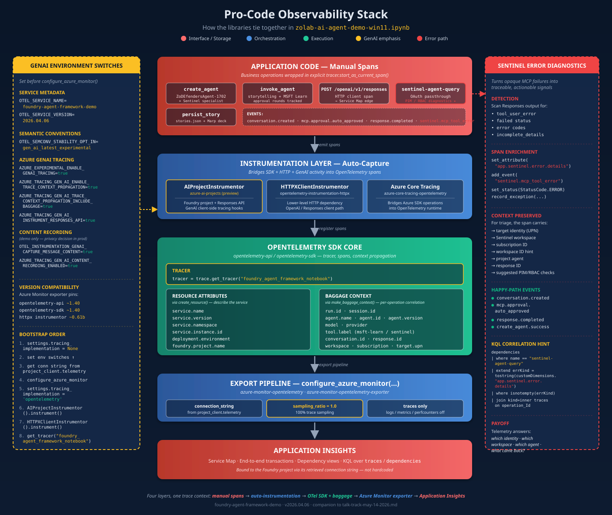

# Windows Notebook Observability and Validation

This document describes Sections 3.1, 3.3, 5, 5.1 and 6 of the [Windows notebook](zolab-ai-agent-demo-win11.ipynb). Dependency review date: **2026-09-14**. Agent execution uses Azure AI Projects and the Foundry Responses API, with native OpenTelemetry resource metadata. Agent Framework is not a runtime dependency of this notebook.

The notebook exports client-side traces to Azure Monitor through the Foundry project's Application Insights connection. Foundry instrumentation supplies GenAI spans, while explicit notebook-side HTTP dependency spans preserve Service Map edges across transport-library changes.

## Observability Continued

The highest-value enhancements that are now applied are:

1. Enforce trace-only export using controls honored by the installed Azure Monitor distro.
2. Enable baggage propagation for the notebook's safe correlation keys.
3. Add an explicit content-recording policy instead of relying on defaults.
4. Harden initialization order for notebook reruns in a reused kernel.
5. Keep custom span metadata in place for agent, run, and interaction correlation.

## What 3.1 & 3.3 Turns On Today

Sections 3.1 and 3.3 in [zolab-ai-agent-demo-win11.ipynb](zolab-ai-agent-demo-win11.ipynb) enable the following:

| Capability | Current behavior in 3.1 | Why it matters |
| --- | --- | --- |
| OpenTelemetry as the Azure SDK tracing backend | `settings.tracing_implementation = "opentelemetry"` | Makes Azure SDK operations emit spans through OTEL instead of using no-op tracing. |
| Azure Monitor export | `configure_azure_monitor(...)` with the project's Application Insights connection string | Sends notebook traces to Azure Monitor so they land in Application Insights and Log Analytics. |
| Foundry client-side tracing | `AIProjectInstrumentor().instrument(...)` with explicit content, trace-context and baggage booleans | Emits client-side GenAI spans with the same content policy as custom notebook spans. |
| HTTP dependency tracing | Azure Monitor auto-instruments HTTPX and HTTPX2 when installed | The HTTPX instrumentation 0.65b0 package contains both instrumentors. OpenAI 3.x uses HTTPX2; no second package or manual re-wrapping is needed. |
| Explicit Responses API dependency spans | Manual `POST /openai/v1/responses` client spans later in the notebook | Ensures Azure Monitor has concrete dependency rows that correlate cleanly in Service Map and KQL. |
| Custom notebook orchestration spans | Manual spans such as `create_agent`, `invoke_agent`, `persist_story`, and Sentinel-specific spans | Makes the notebook's orchestration layer observable rather than only the SDK internals. |
| Resource identity | Native `Resource.create(attributes)` with explicit service, session, environment and project values | Preserves existing identity and additional `OTEL_RESOURCE_ATTRIBUTES`; adds `deployment.environment.name` alongside the legacy environment attribute. |
| GenAI semantic conventions | Owned by Azure AI Projects' installed preview instrumentor | The Agent Framework `gen_ai_latest_experimental` opt-in does not select the Projects SDK's schema and is no longer set here. |
| Baggage propagation | `AZURE_TRACING_GEN_AI_TRACE_CONTEXT_PROPAGATION_INCLUDE_BAGGAGE=true` | Lets the notebook's run, agent, and interaction baggage keys flow with downstream trace context. |
| Explicit content-recording policy | One strict `OTEL_INSTRUMENTATION_GENAI_CAPTURE_MESSAGE_CONTENT` boolean, default `true` for this demo | SDK and custom content agree. Prompts, responses and tool payloads may contain sensitive data; set the flag to `false` before initialization to opt out. The obsolete Azure flag has no effect. UPN is not propagated in baggage. |
| Safer kernel reruns | Identical configurations reuse the provider; changed identity/backend/content or partial failure requires a restart | Prevents duplicate exporters and misleading status after configuration changes. |
| Trace-only local export posture | `OTEL_LOGS_EXPORTER=none`, `OTEL_METRICS_EXPORTER=none`, `enable_live_metrics=False`, `enable_performance_counters=False` | Unlike the former `disable_logging`/`disable_metrics` arguments, these controls take effect in Azure Monitor 1.8.10. |

## How the Telemetry Flows

The telemetry path for this repo is:

1. The notebook creates spans through OpenTelemetry, Azure SDK instrumentation, HTTPX/HTTPX2 instrumentation, and explicit custom spans.
2. `configure_azure_monitor(...)` registers Azure Monitor exporters for the signals that remain enabled.
3. The notebook retrieves the Application Insights connection string from the Foundry project at runtime by calling `project_client.telemetry.get_application_insights_connection_string()`.
4. Azure Monitor sends the exported trace data to Application Insights.
5. Because the Application Insights instance is workspace-based, the same telemetry is queryable in Log Analytics.
6. Agent calls use the Foundry Responses API with `agent_reference`; client-side GenAI spans in the linked Application Insights resource support the Foundry Traces view. Portal rendering is a separate UI check from the Log Analytics assertions.



The diagram above summarizes the same pro-code path visually: notebook orchestration creates explicit spans, Foundry and HTTP client instrumentation enrich the agent and dependency traces, and Azure Monitor exports the resulting telemetry into the operational analysis surfaces.

That gives three useful observability surfaces:

| Surface | Role |
| --- | --- |
| Microsoft Foundry Traces | Agent-centric view of agent execution and tool activity. |
| Azure Monitor / Application Insights | Distributed tracing, dependency tracking, and service-side correlation. |
| Log Analytics | KQL-based investigation, joins, trend analysis, and alert-ready querying. |

In other words, Foundry gives the agent/operator view, while Azure Monitor gives the platform/operations view. OpenTelemetry is the glue that makes the same run observable across both.

## Why This Brings Observability to Agents

Agent observability is useful only if it answers more than "did the call succeed?" The current design gets close to that goal because it makes these layers visible:

| Layer | What becomes observable |
| --- | --- |
| Agent execution layer | Foundry client-side spans and Foundry Traces show agent creation and Responses API activity. |
| Notebook orchestration layer | Custom spans show where the notebook invoked, persisted, or branched into Sentinel-specific paths. |
| Dependency layer | Automatically instrumented HTTPX2 plus explicit client spans create dependency rows for the actual outbound calls. |
| Run correlation layer | Resource attributes and baggage context let a single notebook run be grouped and traced across surfaces. |

That is the correct model for agent observability: agent actions, orchestration decisions, outbound dependencies, and correlation identifiers all need to exist in the same trace story.

## Current Package and Version Posture

The Python **3.14.7** environment was resolved on **2026-09-14** using its configured package index. [requirements-notebook.txt](requirements-notebook.txt) is the Windows notebook's reproducible direct-dependency matrix. Public PyPI metadata advertised some newer releases than the configured index; the table records the versions actually installed, not an unqualified "latest" claim.

| Package | Installed | Notes |
| --- | --- | --- |
| `azure-ai-projects` | `2.6.0` | Project agents, MCP and client-side preview instrumentation. |
| `openai` | `3.8.0` | Responses/conversations API, using HTTPX2. |
| `httpx2` | `2.12.0` | Fixes the published HTTPX2 2.10.0 advisories found during dependency review. |
| `azure-identity` | `1.26.0b2` | Existing preview line retained; no global `--pre` switch. |
| `azure-monitor-opentelemetry` | `1.8.10` | Resolves the matching exporter and instrumentation train. |
| `azure-monitor-opentelemetry-exporter` | `1.0.0b57` | Transitive Azure Monitor exporter. |
| `azure-core-tracing-opentelemetry` | `1.0.0b13` | Azure Core tracing bridge. |
| `opentelemetry-api` / `opentelemetry-sdk` | `1.44.0` | Aligned with Azure Monitor, not upgraded independently. |
| `opentelemetry-instrumentation-httpx` | `0.65b0` | Matches SDK 1.44 and includes separate HTTPX/HTTPX2 instrumentors. |
| `ipykernel` | `7.3.0` | Python 3.14 notebook kernel. |

Install the matrix together, run `pip check`, then restart the kernel if SDKs were already imported. The former `azure-ai-projects<2.5` / OpenAI 2.x restriction is no longer needed. This matrix does not upgrade the bot runtime, macOS notebook or standalone Agent Framework PoC.

### Runtime, Shared and Validation Profiles

- [requirements-notebook.txt](requirements-notebook.txt) contains only runtime requirements (82 resolved dependencies, excluding pip).
- [requirements-notebook-shared.txt](requirements-notebook-shared.txt) adds optional Agent Framework core 1.17.0, OpenAI provider 1.14.2 and OTLP gRPC exporter 1.44.0. These remain compatible with an existing shared environment, but this notebook neither imports Agent Framework nor configures an OTLP exporter.
- [requirements-notebook-validation.txt](requirements-notebook-validation.txt) adds `nbclient==0.11.0` and `nbformat==5.11.0` for automated execution.
- [constraints-notebook-win11.txt](constraints-notebook-win11.txt) captures 100 direct/transitive versions across those profiles for Windows / CPython 3.14. It constrains resolution without installing optional packages; it is not a hash-verified lock or a cross-platform snapshot.

The constrained runtime plus validation profile installs cleanly without Agent Framework or OTLP. Existing shared packages were not uninstalled. The tested Azure Identity preview line was retained; moving to stable credentials remains a separate compatibility exercise.

## Current-Run Telemetry Gate (Section 6)

Section 6 is a validation gate, not just a query display:

1. Resolve `WorkspaceResourceId` from the deployment's Application Insights component. Do not assume the Sentinel data workspace is also the telemetry workspace.
2. Flush the OpenTelemetry provider before querying.
3. Scope to the current `demo.run_id`, then follow `OperationId` to include SDK and HTTP child spans that do not carry that custom attribute themselves.
4. Poll for ingestion at 15-second intervals, up to 12 waits. Empty or old results cannot produce a pass.
5. Require story, facts and (when configured) Sentinel interaction coverage, a correlated Responses API dependency for each interaction, GenAI chat spans, zero failed spans, and service version `2026.09.14`. Azure Monitor combines namespace and service name into `AppRoleName=foundry-agent-demo.foundry-agent-framework-demo`; HTTP dependency names include the full project path, so the gate matches their `/openai/v1/responses` suffix.
6. Reject API errors and partial results. Display the end-to-end rows and a runs-only trend; include `sentinel-agent-query` in both scenarios.

The Sentinel orchestration span now carries both `demo.run_id` and `app.interaction=sentinel`, fixing its omission from run-filtered queries. Its response helper no longer reattaches a context captured before the parent span: doing that detached HTTP dependencies into unrelated operations. The query cells also reject failed/empty responses and exhausted approval loops instead of persisting them as successful results. The Sentinel specialist requires schema discovery and plain KQL, addressing the live `query_lake` backtick/syntax failure encountered during validation.

Generated stories and Marp decks are local demo artifacts, not evidence that the service succeeded by themselves. Review MCP call results and the Section 6 gate as well.

### Trace-Only Policy Follow-up — 2026-09-14

Run `419d2a78-eda0-4168-be3f-65e1afe5baf6` executed all **13 notebook code cells** successfully, plus private validation assertions. The current-run gate observed **55 correlated spans**, **eight response dependencies** covering story/facts/Sentinel, **13 GenAI spans**, and **zero failures**, with the expected role and version.

Unlike the initial trace-only claim, this run also checked actual runtime objects: **no SDK log or metric providers**, **no Live Metrics or performance-counter span processors**, **SDK and custom content capture both off**, and **HTTPX2 auto-instrumentation enabled**.

All **25 regression tests** passed in the existing environment and in a clean runtime-plus-validation environment without Agent Framework or OTLP. The clean install passed `pip check`; the optional shared profile also resolved against the same constraints. Earlier live attempts surfaced Sentinel-generated datetime-format and unquoted projection-alias errors; the specialist instructions now keep datetime values raw and aliases space-free. These remain model-generated queries, so service/tool failures still raise rather than being silently retried or presented as success.

The reduced runtime closure contains **82 packages**, all checked against PyPI version advisory metadata with **zero reported advisories** and no missing metadata entries. This is not a comprehensive security audit. Notebook code in the cleared working copy was compared byte-for-byte per cell with the successful execution.

### Initial Dependency-Upgrade Evidence — 2026-09-14

The final fresh-kernel run executed **all 13 code cells** successfully, followed by an additional local assertion cell. It verified completed story and Microsoft Learn responses, an actual Learn MCP call and Learn URL, a completed Sentinel response without terminal tool errors, both persisted record types, and generated Marp files.

This initial run verified traces only. A subsequent configuration sanity check established that the old log/metric-disable arguments were overwritten by the distro and Live Metrics was enabled by default. The implementation described above corrects that; the initial counts below are not proof that those other signals were disabled.

For run `73b57ebd-8d96-4a42-a5dc-d7475b127bf7`, the ingestion gate observed:

| Check | Result |
| --- | --- |
| Correlated dependency spans | 55 |
| Failed spans | 0 |
| Responses API HTTP dependencies | 8, covering story, facts and Sentinel |
| GenAI chat spans | 13 |
| MCP tool spans | Microsoft Learn search; Sentinel workspace listing, table search and `query_lake` |
| Notebook role / version | `foundry-agent-demo.foundry-agent-framework-demo` / `2026.09.14` |
| Targeted regression tests | 12 passed |
| Dependency consistency | `pip check` passed |
| Advisory metadata | 92 resolved packages checked against PyPI version metadata; zero reported advisories after the HTTPX2 patch |

The advisory check found HTTPX2 2.10.0 affected by [GHSA-h4x7-gw46-3wm6](https://github.com/advisories/GHSA-h4x7-gw46-3wm6), [GHSA-pf96-p4fj-6566](https://github.com/advisories/GHSA-pf96-p4fj-6566), and [GHSA-8xx6-hgc6-gc2m](https://github.com/advisories/GHSA-8xx6-hgc6-gc2m), plus their PYSEC aliases. The 2.12.0 pin clears these reported advisories. This is a metadata check, not a comprehensive security audit.

Run the local regression tests without Azure calls:

```powershell
.\.venv\Scripts\python.exe -m unittest discover -s .\tests -p test_notebook_validation.py -v
```

Tests cover approval boundaries, failed/empty responses, content-recording opt-in, strict Log Analytics result decoding, and the Sentinel parent/child trace relationship using an in-memory exporter. Full integration verification still requires running the notebook against Azure. Foundry portal rendering and the separate macOS/standalone Agent Framework notebooks were not validated by this run. Committed notebooks have cleared outputs; private execution evidence and generated validation decks are not committed.

## Environment Variables in 3.1

These are the important environment variables used in the Windows notebook's current Section 3.1.

| Variable | Set today in 3.1 | What it does | How this repo uses it |
| --- | --- | --- | --- |
| `OTEL_SERVICE_NAME` | Yes | Sets the OTEL service identity. | Used to stamp notebook-generated spans as coming from the Foundry agent demo service. |
| `OTEL_SERVICE_VERSION` | Yes | Sets service version metadata. | Used to distinguish notebook build/version posture in traces. |
| `OTEL_RESOURCE_ATTRIBUTES` | Optional, preserved | Adds resource-level attributes to every span. | Explicit notebook service/project/session/environment attributes take precedence. Supply `cloud.region` only from verified deployment metadata, not a guessed location. |
| `AZURE_EXPERIMENTAL_ENABLE_GENAI_TRACING` | Yes | Explicitly opts the Azure AI Projects SDK into preview GenAI tracing. | Must be set before `AIProjectInstrumentor().instrument()` or Foundry client-side GenAI spans will not be emitted. |
| `AZURE_TRACING_GEN_AI_ENABLE_TRACE_CONTEXT_PROPAGATION` | Yes | Enables W3C trace-context propagation for OpenAI clients returned by `get_openai_client()`. | Helps correlate client-side notebook spans with downstream Azure-side work. |
| `AZURE_TRACING_GEN_AI_TRACE_CONTEXT_PROPAGATION_INCLUDE_BAGGAGE` | Yes | Includes the `baggage` header with propagated trace context. | Used because the notebook's baggage keys are limited to safe correlation metadata such as run ID, agent ID, interaction name, and session ID. |
| `AZURE_TRACING_GEN_AI_INSTRUMENT_RESPONSES_API` | Yes | Enables Responses API instrumentation in the Foundry tracing path. | Used so `responses.create(...)` activity is observable in preview client-side traces. |
| `OTEL_INSTRUMENTATION_GENAI_CAPTURE_MESSAGE_CONTENT` | Yes | Controls SDK and custom prompt/completion capture. | Defaults to `true` for this demo; explicit `false` opts out. Accepts case-insensitive `true`/`false`, normalized once and passed explicitly to the instrumentor. Invalid values fail before provider setup. |
| `OTEL_LOGS_EXPORTER` / `OTEL_METRICS_EXPORTER` | Yes | Select signals to export. | Both set to `none`; these are the effective signal-disable controls in Azure Monitor 1.8.10. |
| `OTEL_TRACES_SAMPLER` / `OTEL_TRACES_SAMPLER_ARG` | Yes | Select the trace sampler. | Set to `microsoft.fixed_percentage` / `1.0` so inherited settings cannot reduce demo coverage. |
| `OTEL_TRACES_EXPORTER` | Checked | Can disable tracing when set to `none`. | `none` is rejected with an actionable error instead of silently producing no traces. |
| `OTEL_EXPERIMENTAL_RESOURCE_DETECTORS` | Yes, only for local/non-Azure runs | Controls which OTEL resource detectors are active. | Set to `otel` locally to avoid Azure-host detector behavior when running outside Azure. |
| `APPLICATIONINSIGHTS_STATSBEAT_DISABLED_ALL` | Yes, only for local/non-Azure runs | Disables Statsbeat telemetry from the Application Insights exporter path. | Reduces local-noise telemetry and keeps the notebook trace-only. |

## Environment Variables to Keep in Mind

These are the main variables to understand when operating Section 3.1.

| Variable | Recommendation | Why it helps |
| --- | --- | --- |
| `AZURE_TRACING_GEN_AI_TRACE_CONTEXT_PROPAGATION_INCLUDE_BAGGAGE=true` | Keep enabled while baggage remains limited to safe correlation keys | Makes the notebook's run and agent identifiers available across downstream trace context. |
| `OTEL_INSTRUMENTATION_GENAI_CAPTURE_MESSAGE_CONTENT=true` | Demo default; explicitly set `false` outside approved content-capture scenarios | Allows prompt, response, tool-argument, and tool-result content to appear in traces, which carries data-exposure risk. |
| `AZURE_TRACING_GEN_AI_INCLUDE_BINARY_DATA` | Leave unset/off | Binary payload recording is unnecessary for this text-only demo. |
| `OTEL_TRACES_SAMPLER` and `OTEL_TRACES_SAMPLER_ARG` | Fixed at 100% for this demo | Changing sampling for production requires revisiting the complete-trace validation gate. |

## Enhancements Applied to 3.1 & 3.3

These are the main changes applied to the Windows 3.1 & 3.3 cells.

### 1. Use Settings Honored by the Actual SDK

The Windows notebook does not set the Agent Framework-specific GenAI opt-in or the obsolete `AZURE_TRACING_GEN_AI_CONTENT_RECORDING_ENABLED` flag. Azure AI Projects 2.6.0 uses its installed preview span schema and reads `OTEL_INSTRUMENTATION_GENAI_CAPTURE_MESSAGE_CONTENT`. HTTP instrumentation has its own semantic-convention behavior; there is no global switch that upgrades every emitted span schema.

### 2. Make baggage propagation an explicit decision

The notebook already creates baggage context, and the Windows 3.1 flow now explicitly turns on baggage propagation so run identifiers, scenario IDs, and notebook correlation markers can flow across more downstream operations:

```python
os.environ["AZURE_TRACING_GEN_AI_TRACE_CONTEXT_PROPAGATION_INCLUDE_BAGGAGE"] = "true"
```

That choice is safe here because the current baggage keys are limited to correlation metadata rather than prompts or other sensitive payload content.

### 3. Add explicit content-recording policy

The Windows 3.1 path now makes message-content capture an explicit policy decision. That matters for agent debugging because content recording is the difference between seeing only operation shape versus seeing the actual prompt/tool payload that drove the result.

`OTEL_INSTRUMENTATION_GENAI_CAPTURE_MESSAGE_CONTENT` defaults to `true` for this controlled demo. Set it explicitly to `false` before initialization to opt out of recording potentially sensitive prompts, responses and tool payloads. The helper parses it once, uses the same boolean for SDK and custom spans, and rejects ambiguous values such as `1`. Explicit environment values take precedence over the default, including a `false` left by a previous run. Restart the kernel to pick up the changed default; if `false` is inherited from the launching environment, change or remove that override as well. The notebook refuses to display a new policy while retaining an old provider configuration.

This setting is not a universal redaction filter. Exception messages, MCP diagnostics, saved stories and generated decks may contain sensitive information independently of normal prompt/completion capture.

The live-run evidence above records the earlier content-off policy. The later default-on change is covered by local regression tests for the default, explicit opt-out, SDK agreement and restart guard; that historical content-off result is not a claim about the new default.

### 4. Harden the initialization order for notebook reruns

The Windows notebook now uses the safer order already proven in the macOS variant: it delays `settings.tracing_implementation = "opentelemetry"` until after Azure Monitor is configured. That is a good notebook-specific hardening tactic because reused kernels can inherit stale global tracer-provider state.

For a notebook, I recommend this order:

1. Set environment variables.
2. Resolve the Application Insights connection string from the Foundry project.
3. Call `configure_azure_monitor(...)`.
4. Then switch `settings.tracing_implementation` to `"opentelemetry"`.
5. Apply the content/propagation booleans to `AIProjectInstrumentor`, then verify its state and the distro-owned HTTPX2 instrumentor. Do not uninstrument or manually re-wrap HTTP clients.

The helper remembers its backend/resource/content configuration. Identical reruns do not call Azure Monitor again. Changed configuration or a prior partially failed setup requires a fresh kernel.

### 5. Add a span processor for agent metadata

Microsoft's Foundry tracing guidance explicitly supports adding a custom span processor. That remains a reasonable next step if you want every span to include the same correlation metadata without repeating `span.set_attribute(...)` everywhere.

Good candidates include:

| Attribute | Value idea |
| --- | --- |
| `session.id` | Notebook telemetry session UUID |
| `gen_ai.agent.name` | Main agent or Sentinel agent name |
| `gen_ai.agent.id` | Agent ID when available |
| `demo.scenario` | `storytelling`, `msft_learn`, or `sentinel` |
| `foundry.project.name` | Already present in resource attributes; keep consistent |

### 6. Keep traces on, keep logs and metrics off by default for the notebook

The trace-only policy uses exporter environment variables, not the old `disable_logging` and `disable_metrics` keyword arguments. Live Metrics is independently disabled because it defaults to on in Azure Monitor 1.8.10. Performance counters stay disabled. This is a notebook trace-demo policy, not a claim that logs or metrics are undesirable in production.

I would keep that default, and only add logs later if you want:

1. structured prompt-routing logs,
2. tool-selection audit logs, or
3. alerting on agent failures without relying only on traces.

## Practical Recommendation

If you want the best improvement-to-effort ratio beyond the current notebook state, do these next:

1. Add a lightweight custom span processor for cross-cutting agent metadata.
2. Deliberately redesign sampling and the validation gate if you need lower-cost long-running telemetry.
3. Keep reviewing which baggage keys are safe to propagate as the notebook evolves.
4. Turn on content recording only for controlled debugging windows.

Those changes would make Section 3.1 more complete without changing the overall design.

## Bottom Line

Section 3.1 already has the right architecture for agent observability:

1. OpenTelemetry provides the instrumentation model.
2. Azure Monitor provides the export path and operational analysis surface.
3. Application Insights and Log Analytics provide queryable distributed traces and dependencies.
4. Microsoft Foundry Traces provides the agent-specific execution view.

The meaningful enhancements are not about replacing Azure Monitor or OTEL. They are about making the existing trace story richer, more policy-driven, and more reliable for repeated notebook runs.

## References

1. Microsoft Foundry client-side tracing: https://learn.microsoft.com/azure/foundry/observability/how-to/trace-agent-client-side
2. Set up tracing in Microsoft Foundry: https://learn.microsoft.com/azure/foundry/observability/how-to/trace-agent-setup
3. Azure Monitor OpenTelemetry configuration: https://learn.microsoft.com/azure/azure-monitor/app/opentelemetry-configuration
4. Azure Monitor OpenTelemetry Python package: https://learn.microsoft.com/python/api/overview/azure/monitor-opentelemetry-readme?view=azure-python
5. OpenTelemetry Python: https://opentelemetry.io/docs/languages/python/